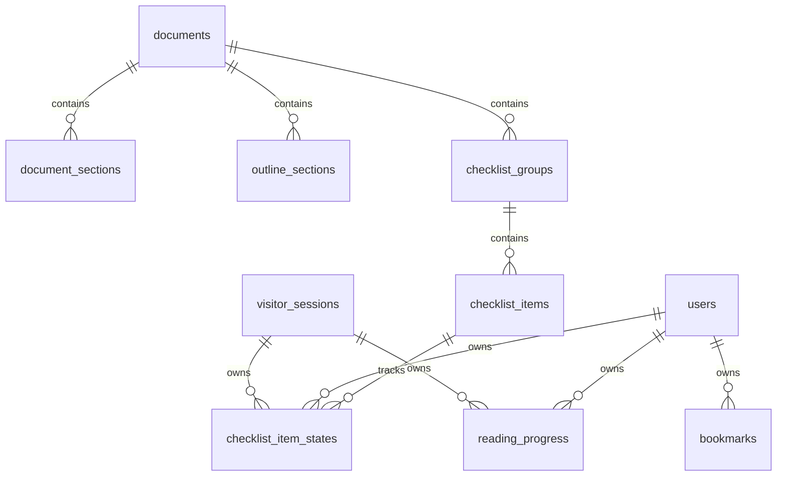

# 資料表 Schema 初稿版

對應文件：

- [backend-design.md](./backend-design.md)
- [api-spec-draft.md](./api-spec-draft.md)
- [design.md](./design.md)

目的：

- 為學習型內容網站提供可討論、可演進的 PostgreSQL schema 初稿
- 作為 migration 規劃、ORM 建模與 API 契約落地的基礎

版本：Draft v0.1  
更新日期：2026-03-24

---

## 1. 設計前提

### 1.1 產品前提

這個產品以內容閱讀與狀態同步為核心，因此資料庫重點不在複雜交易一致性，而在：

- 內容結構穩定
- slug 與對應關係穩定
- 使用者進度可同步
- checklist 狀態可同步
- 搜尋與事件分析可擴充

### 1.2 資料來源策略

建議內容以 Git 內 Markdown 為真實來源，資料庫先承擔：

- 結構化內容快取 / metadata
- 導航與關聯查詢
- 搜尋索引
- 使用者狀態
- 分析事件

### 1.3 資料庫假設

- PostgreSQL 15+
- 使用 `gen_random_uuid()`
- 啟用擴充套件：
  - `pgcrypto`
  - `pg_trgm`
  - `citext`

---

## 2. 命名與建模原則

### 2.1 通用規則

- 表名：snake_case 複數或穩定名詞
- 主鍵：`uuid`
- 時間欄位：`timestamptz`
- JSON 結構欄位：`jsonb`
- 對外穩定識別：
  - 文件：`document_slug`
  - 章節：`section_slug`
  - 群組：`group_code`
  - 清單項目：`item_id` + `item_code`

### 2.2 身分主體規則

狀態型資料表預設支援兩種 principal：

- `user_id`
- `visitor_session_id`

約束：

- 同一列只能有其中一個
- 不能同時為空
- 不能同時有值

### 2.3 Migration 原則

- 先建 enum / extension
- 再建內容層資料表
- 再建身分與狀態表
- 最後建索引與分析表

---

## 3. ERD 草案



---

## 4. Enum 與基礎型別草案

```sql
CREATE EXTENSION IF NOT EXISTS pgcrypto;
CREATE EXTENSION IF NOT EXISTS pg_trgm;
CREATE EXTENSION IF NOT EXISTS citext;

CREATE TYPE document_type AS ENUM ('guide', 'outline', 'checklist');

CREATE TYPE user_status AS ENUM ('active', 'disabled');

CREATE TYPE subject_type AS ENUM (
  'guide_document',
  'guide_section',
  'outline_section',
  'checklist_group'
);

CREATE TYPE search_source_type AS ENUM (
  'guide_section',
  'outline_section',
  'checklist_item'
);
```

---

## 5. 內容層資料表

## 5.1 `documents`

用途：

- 表示一份邏輯文件，例如 guide / outline / checklist

```sql
CREATE TABLE documents (
  id uuid PRIMARY KEY DEFAULT gen_random_uuid(),
  document_slug text NOT NULL UNIQUE,
  document_type document_type NOT NULL,
  title text NOT NULL,
  subtitle text,
  source_path text NOT NULL UNIQUE,
  source_checksum text NOT NULL,
  content_version text NOT NULL,
  is_published boolean NOT NULL DEFAULT true,
  created_at timestamptz NOT NULL DEFAULT now(),
  updated_at timestamptz NOT NULL DEFAULT now()
);
```

欄位說明：

- `document_slug`：對外穩定值，建議固定為 `guide`、`outline`、`checklist`
- `source_checksum`：檔案內容摘要，用於同步與快取失效判斷
- `content_version`：前後端可共同依賴的版本值

## 5.2 `document_sections`

用途：

- guide 的章節與段落級 metadata
- 儲存 guide 單章節的可直接渲染內容

```sql
CREATE TABLE document_sections (
  id uuid PRIMARY KEY DEFAULT gen_random_uuid(),
  document_id uuid NOT NULL REFERENCES documents(id) ON DELETE CASCADE,
  section_slug text NOT NULL UNIQUE,
  title text NOT NULL,
  summary text,
  phase_code text,
  level smallint NOT NULL DEFAULT 2,
  sort_order integer NOT NULL,
  estimated_read_minutes integer NOT NULL DEFAULT 1,
  body_markdown text NOT NULL,
  body_plaintext text NOT NULL,
  headings_json jsonb NOT NULL DEFAULT '[]'::jsonb,
  related_checklist_group_codes text[] NOT NULL DEFAULT '{}'::text[],
  prev_section_slug text,
  next_section_slug text,
  created_at timestamptz NOT NULL DEFAULT now(),
  updated_at timestamptz NOT NULL DEFAULT now(),
  UNIQUE (document_id, sort_order)
);

CREATE INDEX idx_document_sections_document_id ON document_sections(document_id);
CREATE INDEX idx_document_sections_phase_code ON document_sections(phase_code);
```

備註：

- `body_markdown` 讓 API 不必每次即時從檔案解析
- `body_plaintext` 供搜尋或摘要擷取使用
- `headings_json` 供前端快速渲染章內目錄

## 5.3 `outline_sections`

用途：

- 速讀模式卡片資料

```sql
CREATE TABLE outline_sections (
  id uuid PRIMARY KEY DEFAULT gen_random_uuid(),
  document_id uuid NOT NULL REFERENCES documents(id) ON DELETE CASCADE,
  section_slug text NOT NULL UNIQUE,
  title text NOT NULL,
  summary text NOT NULL,
  highlights_json jsonb NOT NULL DEFAULT '[]'::jsonb,
  related_guide_section_slugs text[] NOT NULL DEFAULT '{}'::text[],
  sort_order integer NOT NULL,
  created_at timestamptz NOT NULL DEFAULT now(),
  updated_at timestamptz NOT NULL DEFAULT now(),
  UNIQUE (document_id, sort_order)
);
```

## 5.4 `checklist_groups`

用途：

- checklist 群組，例如 A, B, C...

```sql
CREATE TABLE checklist_groups (
  id uuid PRIMARY KEY DEFAULT gen_random_uuid(),
  document_id uuid NOT NULL REFERENCES documents(id) ON DELETE CASCADE,
  group_code text NOT NULL UNIQUE,
  title text NOT NULL,
  description text,
  sort_order integer NOT NULL,
  related_guide_section_slugs text[] NOT NULL DEFAULT '{}'::text[],
  created_at timestamptz NOT NULL DEFAULT now(),
  updated_at timestamptz NOT NULL DEFAULT now(),
  UNIQUE (document_id, sort_order)
);
```

## 5.5 `checklist_items`

用途：

- checklist 每一個可勾選項目

```sql
CREATE TABLE checklist_items (
  id uuid PRIMARY KEY DEFAULT gen_random_uuid(),
  group_id uuid NOT NULL REFERENCES checklist_groups(id) ON DELETE CASCADE,
  item_code text NOT NULL UNIQUE,
  label text NOT NULL,
  guidance text,
  related_section_slug text,
  sort_order integer NOT NULL,
  is_required boolean NOT NULL DEFAULT false,
  created_at timestamptz NOT NULL DEFAULT now(),
  updated_at timestamptz NOT NULL DEFAULT now(),
  UNIQUE (group_id, sort_order)
);

CREATE INDEX idx_checklist_items_group_id ON checklist_items(group_id);
CREATE INDEX idx_checklist_items_related_section_slug ON checklist_items(related_section_slug);
```

---

## 6. 身分與同步主體資料表

## 6.1 `users`

用途：

- 未來登入後的正式主體

```sql
CREATE TABLE users (
  id uuid PRIMARY KEY DEFAULT gen_random_uuid(),
  email citext NOT NULL UNIQUE,
  display_name text,
  status user_status NOT NULL DEFAULT 'active',
  created_at timestamptz NOT NULL DEFAULT now(),
  updated_at timestamptz NOT NULL DEFAULT now()
);
```

## 6.2 `visitor_sessions`

用途：

- 匿名使用者同步主體

```sql
CREATE TABLE visitor_sessions (
  id uuid PRIMARY KEY DEFAULT gen_random_uuid(),
  visitor_key text NOT NULL UNIQUE,
  first_seen_at timestamptz NOT NULL DEFAULT now(),
  last_seen_at timestamptz NOT NULL DEFAULT now(),
  last_user_agent text,
  last_ip inet,
  created_at timestamptz NOT NULL DEFAULT now(),
  updated_at timestamptz NOT NULL DEFAULT now()
);
```

備註：

- `visitor_key` 可來自前端 local-first 模式
- 若未來改為 server-issued cookie，可保留此表不變

---

## 7. 使用者狀態資料表

## 7.1 `reading_progress`

用途：

- 同步閱讀進度

```sql
CREATE TABLE reading_progress (
  id uuid PRIMARY KEY DEFAULT gen_random_uuid(),
  user_id uuid REFERENCES users(id) ON DELETE CASCADE,
  visitor_session_id uuid REFERENCES visitor_sessions(id) ON DELETE CASCADE,
  subject_type subject_type NOT NULL,
  subject_slug text NOT NULL,
  scroll_percent numeric(5,2) NOT NULL DEFAULT 0,
  is_completed boolean NOT NULL DEFAULT false,
  first_read_at timestamptz NOT NULL DEFAULT now(),
  last_read_at timestamptz NOT NULL DEFAULT now(),
  completed_at timestamptz,
  created_at timestamptz NOT NULL DEFAULT now(),
  updated_at timestamptz NOT NULL DEFAULT now(),
  CONSTRAINT chk_reading_progress_principal
    CHECK (
      (user_id IS NOT NULL AND visitor_session_id IS NULL) OR
      (user_id IS NULL AND visitor_session_id IS NOT NULL)
    ),
  CONSTRAINT chk_reading_progress_scroll_percent
    CHECK (scroll_percent >= 0 AND scroll_percent <= 100)
);

CREATE UNIQUE INDEX uq_reading_progress_user_subject
  ON reading_progress(user_id, subject_type, subject_slug)
  WHERE user_id IS NOT NULL;

CREATE UNIQUE INDEX uq_reading_progress_visitor_subject
  ON reading_progress(visitor_session_id, subject_type, subject_slug)
  WHERE visitor_session_id IS NOT NULL;

CREATE INDEX idx_reading_progress_last_read_at ON reading_progress(last_read_at DESC);
```

## 7.2 `checklist_item_states`

用途：

- 同步 checklist 勾選狀態

```sql
CREATE TABLE checklist_item_states (
  id uuid PRIMARY KEY DEFAULT gen_random_uuid(),
  item_id uuid NOT NULL REFERENCES checklist_items(id) ON DELETE CASCADE,
  user_id uuid REFERENCES users(id) ON DELETE CASCADE,
  visitor_session_id uuid REFERENCES visitor_sessions(id) ON DELETE CASCADE,
  is_checked boolean NOT NULL DEFAULT false,
  checked_at timestamptz,
  created_at timestamptz NOT NULL DEFAULT now(),
  updated_at timestamptz NOT NULL DEFAULT now(),
  CONSTRAINT chk_checklist_item_states_principal
    CHECK (
      (user_id IS NOT NULL AND visitor_session_id IS NULL) OR
      (user_id IS NULL AND visitor_session_id IS NOT NULL)
    )
);

CREATE UNIQUE INDEX uq_checklist_item_states_user_item
  ON checklist_item_states(user_id, item_id)
  WHERE user_id IS NOT NULL;

CREATE UNIQUE INDEX uq_checklist_item_states_visitor_item
  ON checklist_item_states(visitor_session_id, item_id)
  WHERE visitor_session_id IS NOT NULL;

CREATE INDEX idx_checklist_item_states_item_id ON checklist_item_states(item_id);
```

## 7.3 `bookmarks`

用途：

- Phase 2 預留，供使用者收藏章節與筆記

```sql
CREATE TABLE bookmarks (
  id uuid PRIMARY KEY DEFAULT gen_random_uuid(),
  user_id uuid NOT NULL REFERENCES users(id) ON DELETE CASCADE,
  section_slug text NOT NULL,
  note text,
  created_at timestamptz NOT NULL DEFAULT now(),
  updated_at timestamptz NOT NULL DEFAULT now(),
  UNIQUE (user_id, section_slug)
);
```

---

## 8. 搜尋與分析資料表

## 8.1 `search_documents`

用途：

- 儲存搜尋用的正規化文本
- 與內容主表解耦

```sql
CREATE TABLE search_documents (
  id uuid PRIMARY KEY DEFAULT gen_random_uuid(),
  source_type search_source_type NOT NULL,
  source_key text NOT NULL UNIQUE,
  document_slug text NOT NULL,
  section_slug text,
  group_code text,
  item_code text,
  title text NOT NULL,
  body_text text NOT NULL,
  created_at timestamptz NOT NULL DEFAULT now(),
  updated_at timestamptz NOT NULL DEFAULT now()
);

CREATE INDEX idx_search_documents_document_slug ON search_documents(document_slug);
CREATE INDEX idx_search_documents_section_slug ON search_documents(section_slug);
CREATE INDEX idx_search_documents_group_code ON search_documents(group_code);

CREATE INDEX idx_search_documents_title_trgm
  ON search_documents USING gin (title gin_trgm_ops);

CREATE INDEX idx_search_documents_body_text_trgm
  ON search_documents USING gin (body_text gin_trgm_ops);
```

關鍵說明：

- 因為內容主要是中文，MVP 優先用 `pg_trgm`
- 若未來要做更好的中文全文搜尋，可：
  - 升級 Meilisearch
  - 或引入更適合中文斷詞的方案

## 8.2 `event_ingest_logs`

用途：

- 接收前端事件
- 作為分析與背景聚合輸入

```sql
CREATE TABLE event_ingest_logs (
  id bigserial PRIMARY KEY,
  event_id uuid NOT NULL DEFAULT gen_random_uuid(),
  request_id text,
  event_name text NOT NULL,
  user_id uuid REFERENCES users(id) ON DELETE SET NULL,
  visitor_session_id uuid REFERENCES visitor_sessions(id) ON DELETE SET NULL,
  page text,
  occurred_at timestamptz NOT NULL,
  received_at timestamptz NOT NULL DEFAULT now(),
  payload jsonb NOT NULL DEFAULT '{}'::jsonb,
  source text NOT NULL DEFAULT 'web'
);

CREATE INDEX idx_event_ingest_logs_event_name ON event_ingest_logs(event_name);
CREATE INDEX idx_event_ingest_logs_occurred_at ON event_ingest_logs(occurred_at DESC);
CREATE INDEX idx_event_ingest_logs_user_id ON event_ingest_logs(user_id);
CREATE INDEX idx_event_ingest_logs_visitor_session_id ON event_ingest_logs(visitor_session_id);
CREATE INDEX idx_event_ingest_logs_payload_gin ON event_ingest_logs USING gin (payload);
```

## 8.3 `daily_metrics`

用途：

- 背景工作彙整後的日級指標快照

```sql
CREATE TABLE daily_metrics (
  metric_date date NOT NULL,
  metric_key text NOT NULL,
  dimension_key text NOT NULL DEFAULT 'all',
  metric_value numeric(18,4) NOT NULL,
  dimensions jsonb NOT NULL DEFAULT '{}'::jsonb,
  created_at timestamptz NOT NULL DEFAULT now(),
  PRIMARY KEY (metric_date, metric_key, dimension_key)
);
```

注意：

- `dimensions` 保留原始維度資料
- `dimension_key` 作為聚合鍵，避免直接把 `jsonb` 當主鍵
- 這張表屬 Phase 2 偏向，可先不實作

---

## 9. 索引策略摘要

| 表 | 索引重點 | 原因 |
|---|---|---|
| `documents` | `document_slug` unique | 快速定位文件 |
| `document_sections` | `section_slug`, `document_id + sort_order`, `phase_code` | 導航與章節讀取 |
| `checklist_groups` | `group_code` unique | 穩定群組識別 |
| `checklist_items` | `group_id`, `related_section_slug` | group 展示與關聯查詢 |
| `reading_progress` | principal + subject unique | upsert 與進度查詢 |
| `checklist_item_states` | principal + item unique | 勾選狀態同步 |
| `search_documents` | trigram on `title`, `body_text` | 中文搜尋 MVP |
| `event_ingest_logs` | `event_name`, `occurred_at` | 查詢與聚合 |

---

## 10. 關鍵約束與資料一致性規則

### 10.1 穩定鍵

前後端協作最重要的穩定鍵：

- `document_slug`
- `section_slug`
- `group_code`
- `item_code`
- `id`

### 10.2 visitor / user 約束

`reading_progress` 與 `checklist_item_states`：

- 同一列只能掛一種 principal
- visitor 升級成 user 時，應透過服務層做資料合併，不建議直接 SQL 暴力更新

### 10.3 刪除策略

MVP 建議：

- 內容表可直接 hard delete + 重建同步
- 使用者狀態與事件資料不要隨便 hard delete

### 10.4 checklist 狀態策略

不要用 delete 代表未勾選，建議：

- 永遠保留一列
- 用 `is_checked` 表示狀態
- 這樣比較容易做同步與審查

---

## 11. 建議 migration 順序

1. extension 與 enum
2. `documents`
3. `document_sections`
4. `outline_sections`
5. `checklist_groups`
6. `checklist_items`
7. `users`
8. `visitor_sessions`
9. `reading_progress`
10. `checklist_item_states`
11. `search_documents`
12. `event_ingest_logs`
13. `bookmarks`
14. `daily_metrics`

---

## 12. 同步與資料流建議

### 12.1 內容同步流程

建議：

1. 讀取 Markdown 檔案
2. 解析出文件、章節、摘要、heading、關聯
3. upsert 到 `documents`、`document_sections`、`outline_sections`、`checklist_groups`、`checklist_items`
4. 重建 `search_documents`

### 12.2 前端狀態同步流程

建議：

1. 前端 local-first 更新
2. 背景送 `PUT /me/progress` 或 `PUT /me/checklist`
3. 後端用 unique index + upsert 合併
4. 前端下次進站再 `GET` 同步

### 12.3 visitor 轉 user 合併流程

建議：

1. 使用者登入
2. 後端取得 `visitor_session_id`
3. 合併 `reading_progress`
4. 合併 `checklist_item_states`
5. 以 user 記錄為主體，visitor 記錄標記失效或保留歷史

---

## 13. ORM 建模提醒

若使用 SQLAlchemy：

- `document_slug`、`section_slug`、`group_code`、`item_code` 要在 model 清楚標明 unique
- `reading_progress` 與 `checklist_item_states` 的 principal check constraint 不要漏
- update timestamp 建議統一由 ORM hook 或 DB trigger 管理

---

## 14. 尚待確認的開放問題

1. `document_sections` 是否要長期保存 `body_markdown`
2. 中文搜尋 MVP 究竟採 `pg_trgm` 還是直接上 Meilisearch
3. `daily_metrics` 是否在第一版就要落表
4. 書籤與筆記是否應提前預留更多欄位
5. visitor 升級 user 的合併策略是否需要審計記錄

---

## 15. 建議下一步

如果下一步要往實作走，建議先做：

1. `documents`、`document_sections`、`checklist_groups`、`checklist_items`
2. `visitor_sessions`
3. `reading_progress`
4. `checklist_item_states`
5. `search_documents`

這樣就足夠支撐第一版前後端聯調。
