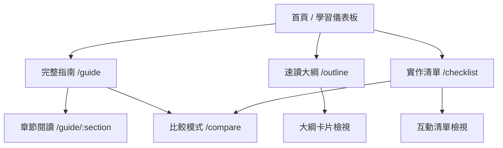

# 學習型內容網站前端設計規劃與開發提示詞

對應內容來源：

- [study.md](./study.md)
- [study-quick-outline.md](./study-quick-outline.md)
- [study-implementation-checklist.md](./study-implementation-checklist.md)

相關協作文件：

- [backend-design.md](./backend-design.md)
- [api-spec-draft.md](./api-spec-draft.md)
- [db-schema-draft.md](./db-schema-draft.md)
- [to-canvas.md](./doc/to-canvas.md)

本文件目標：

- 把三份內容文件轉成一個真正好讀、好用、好學的前端網頁產品
- 規劃明確的版面配置、資訊架構、UI/UX 與互動規則
- 產出可直接交給前端工程師或 AI coding assistant 的完整開發提示詞

這次只做設計與提示詞，不做頁面開發。

---

## 1. 產品定位

### 1.1 產品本質

這不是一般的文件頁，也不是普通部落格，而是：

**一個用來學習、閱讀、定位、切換模式、追蹤進度、執行檢查的學習型知識網站。**

使用者不是只想「看完一篇文章」，而是想：

- 快速理解整體網站開發流程
- 在不同深度之間切換
- 在實作時隨手拿出清單檢查
- 對照完整版、速讀版與檢查清單
- 持續回來複習，而不是只讀一次

### 1.2 核心產品任務

這個前端網站要同時支援三種主要任務：

1. **閱讀學習**：把完整內容讀懂
2. **快速複習**：用大綱快速回想結構
3. **實作套用**：在做專案時用檢查清單執行

### 1.3 核心成功標準

前端體驗做得好的標誌不是「很漂亮」，而是：

- 使用者能在 5 秒內知道這個網站怎麼用
- 使用者能在 1 分鐘內找到自己要看的段落
- 使用者能在 2 秒內從完整版切到速讀版或清單版
- 使用者能清楚知道自己目前在整個學習路徑的哪個位置
- 使用者在桌機與手機上都能流暢閱讀與勾選清單

---

## 2. 目標使用者與情境

### 2.1 主要使用者

| 使用者 | 需求 | 最重要任務 |
|---|---|---|
| 自學者 | 想系統學會網站開發流程 | 從完整內容中建立框架，再快速複習 |
| 實作者 | 正在規劃網站或做專案 | 邊讀邊對照檢查清單 |
| 團隊協作者 | 想快速對齊流程與標準 | 看大綱、看階段、抓重點 |

### 2.2 核心使用情境

- 我第一次打開網站，想先知道整體架構和學習順序
- 我已經知道大概內容，想快速複習第 5 到第 8 階段
- 我正在做網站，想用檢查清單逐項確認
- 我想比較完整版說明和實作清單之間的對應
- 我在手機上通勤時想快速讀大綱，回到桌機再深入看全文

---

## 3. 產品策略：不要做成單純文件頁

### 3.1 體驗方向

這個網站應該像：

- 一個有導航感的學習工作台
- 一個能切換深度的知識閱讀器
- 一個把內容和行動結合的實作儀表板

而不是：

- 單欄純 Markdown 網頁
- generic SaaS dashboard
- 紫色漸層加白卡的 AI 樣板頁
- 只有首頁好看、內容頁很普通的展示站

### 3.2 關鍵設計原則

- **一眼知道在哪裡**：整體流程位置感要很強
- **一鍵切換模式**：完整內容 / 速讀大綱 / 實作清單要隨時切換
- **閱讀不迷路**：左側階段導航、右側上下文工具必須穩定存在
- **內容可行動化**：不只是讀，還要能勾選、標記、回到進度
- **長內容不疲勞**：視覺節奏、留白、段落層次和 sticky UI 要處理好
- **手機版不是縮小桌機**：手機版要重排流程，不只是壓縮欄位

---

## 4. 內容模型與資訊架構

### 4.1 內容來源對應

| 檔案 | 前端角色 | 建議呈現方式 |
|---|---|---|
| `study.md` | 主學習內容 | 長文閱讀器 + 分段導航 + 章節卡片 |
| `study-quick-outline.md` | 速讀模式 | 摘要卡片 + 流程大綱 + 可折疊區塊 |
| `study-implementation-checklist.md` | 實作模式 | 分組互動清單 + 進度條 + 篩選器 |

### 4.2 建議站點結構



### 4.3 建議頁面與路由

| 路由 | 用途 | 核心內容 |
|---|---|---|
| `/` | 首頁 / 儀表板 | 學習入口、進度、模式選擇、推薦閱讀路徑 |
| `/guide` | 完整閱讀模式 | `study.md` 全文、章節導覽、閱讀工具 |
| `/guide/[slug]` | 章節閱讀頁 | 聚焦某一章，適合深度閱讀與分享 |
| `/outline` | 速讀模式 | `study-quick-outline.md` 的卡片化摘要 |
| `/checklist` | 實作模式 | `study-implementation-checklist.md` 的互動式清單 |
| `/compare` | 比較模式 | 左右對照全文 / 清單，或大綱 / 清單 |

### 4.4 不建議額外做的頁面

- 不需要做登入系統
- 不需要做複雜社交功能
- 不需要做評論區
- 不需要做過度 CMS 化後台

第一版前端重點應放在閱讀體驗與實作支持，而不是功能膨脹。

---

## 5. 核心使用者流程

### 5.1 首次使用流程

1. 進入首頁
2. 看見網站定位與三種模式
3. 透過「從哪裡開始」卡片選擇路徑
4. 進入完整指南或速讀大綱
5. 看見當前位於哪個階段
6. 如有需要，切換到實作清單

### 5.2 進階使用流程

1. 回到網站
2. 從首頁的「繼續上次進度」進入
3. 在章節頁查看對應清單
4. 勾選實作項目
5. 切回完整說明釐清觀念

### 5.3 手機使用流程

1. 進入首頁
2. 透過頂部模式切換進入速讀或清單
3. 用底部快速列開啟目錄或進度
4. 在較短的瀏覽片段中完成快速複習或局部檢查

---

## 6. 版面配置總體規劃

### 6.1 桌機 App Shell

建議使用三欄式學習工作台：

- **左欄**：全站與章節導航
- **中欄**：主要閱讀區
- **右欄**：上下文工具與進度

桌機結構：

```text
┌────────────────────────────────────────────────────────────────────────────┐
│ Sticky Top Bar: logo / mode switch / search / reading tools / progress    │
├──────────────────────┬─────────────────────────────────┬───────────────────┤
│ Left Rail            │ Main Reading Stage              │ Right Utility     │
│ 280px                │ minmax(720px, 860px)           │ 300px             │
│                      │                                 │                   │
│ - 路線圖             │ - Hero / section intro          │ - 閱讀進度         │
│ - 章節目錄           │ - 正文 / 大綱 / 清單內容       │ - 快速操作         │
│ - 文件切換           │ - callout / cards / tables      │ - 對應章節         │
│ - 最近位置           │ - sticky subsection headings    │ - 相關提醒         │
└──────────────────────┴─────────────────────────────────┴───────────────────┘
```

### 6.2 平板版面

- 左欄保留，但可收合
- 右欄改為可展開抽屜或底部面板
- 中欄成為唯一主閱讀區

### 6.3 手機版面

手機版不建議維持三欄，而是改成：

- **頂部 sticky bar**
- **模式切換 segmented control**
- **主內容單欄**
- **底部快速操作列**

手機結構：

```text
┌────────────────────────────┐
│ Top Bar: logo / search / ☰ │
├────────────────────────────┤
│ Mode Switch                │
│ Guide | Outline | Checklist│
├────────────────────────────┤
│ Stage Ribbon / Progress    │
├────────────────────────────┤
│ Main Content               │
│ - hero                     │
│ - cards                    │
│ - article / checklist      │
└──────────────┬─────────────┘
               │ Bottom Bar
               │ 目錄 / 進度 / 下一段
```

---

## 7. 各頁面版面規劃

## 7.1 首頁 `/`

### 首頁目標

- 讓人立刻理解這個網站怎麼用
- 幫使用者在三種模式中做選擇
- 呈現整體學習地圖與目前進度

### 首頁內容區塊

1. **Hero 區**
   - 標題：學網站開發流程，不只讀文件，而是照流程真正做出來
   - 副標：從 MVP 到規模化，AI 時代版
   - 三個主 CTA：
     - 開始完整學習
     - 10 分鐘快速複習
     - 開始實作檢查

2. **學習模式卡片**
   - 完整指南
   - 速讀大綱
   - 實作清單
   - 每張卡都要附一句「適合何時使用」

3. **流程地圖區**
   - 用 0 到 8 階段的橫向時間帶或垂直階梯式卡片
   - 每個階段可直接點入對應章節

4. **繼續學習區**
   - 上次閱讀章節
   - 完成比例
   - 最近勾選的 checklist 群組

5. **推薦閱讀路徑**
   - 新手先看：完整指南第 1, 2, 3, 4 章
   - 實作前先看：第 5, 6, 7, 8 章
   - 上線前先看：第 9, 10, 11, 12 章

### 首頁 UX 重點

- CTA 必須非常明確，不要讓首頁像單純文章封面
- 流程地圖要有位置感，而不是零散卡片
- 首頁應該像學習儀表板，而不是行銷 Landing Page

## 7.2 完整閱讀頁 `/guide`

### 閱讀頁目標

- 支援長內容深度閱讀
- 讓使用者始終知道自己在哪一章、下一章是什麼
- 能快速跳去對應大綱與清單

### 閱讀頁三欄內容

**左欄**

- 全站模式切換
- 完整章節目錄
- 目前章節高亮
- 已讀進度標記
- 回到首頁 / 上次位置

**中欄**

- 頁首區：章節標題、摘要、閱讀時間、所屬階段
- 正文渲染區
- callout 元件：重點、風險、原則、實務建議
- 表格、流程圖、程式碼塊、清單
- 章節尾端：上一章 / 下一章 / 對應清單

**右欄**

- 章內小目錄
- 閱讀進度環
- 快速切換到速讀版
- 快速切換到對應 checklist 群組
- 閱讀設定：
  - 字級
  - 行高
  - 專注模式
  - 展開全部 / 摺疊輔助卡

### 閱讀頁 UX 重點

- 標題層級要很清楚
- 段落寬度不要太寬，建議 70 到 78 字元閱讀寬
- Sticky 元件要克制，不能壓迫正文
- 正文不是一整面白牆，應有適度節奏感與層次塊

## 7.3 速讀大綱頁 `/outline`

### 目標

- 讓使用者在短時間抓到全貌
- 適合第二次、第三次回來複習

### 呈現方式

- 每一節做成卡片化區塊
- 頂部有總覽流程條
- 卡片預設顯示 3 到 5 個重點
- 每張卡可展開查看更多
- 每張卡都能跳到完整版對應章節

### UX 重點

- 節奏要比全文更快
- 視覺層級要更高對比
- 避免長段落
- 更適合卡片、流程、摘要塊

## 7.4 實作清單頁 `/checklist`

### 目標

- 把靜態清單變成可執行工具
- 支援分階段勾選、篩選與進度追蹤

### 核心區塊

- 頂部摘要：
  - 總完成度
  - 已完成項目數
  - 未完成項目數
  - 最近更新群組

- 篩選器：
  - 全部
  - 未完成
  - 已完成
  - 依階段篩選

- 清單群組：
  - A 問題定義
  - B MVP
  - C UX/UI
  - ...

- 每組支援：
  - 全展開 / 全收合
  - 小計進度條
  - 群組說明

### Checklist UX 重點

- checkbox 區域要大，便於手機點擊
- 完成項目要有視覺回饋，但不要消失
- 進度要即時更新
- 勾選狀態建議存到 localStorage
- 每組要能回跳對應完整內容

## 7.5 比較模式 `/compare`

### 目標

- 一邊看原理，一邊做檢查

### 建議配置

- 左側：完整指南或速讀大綱
- 右側：對應 checklist 群組
- 中間有同步定位按鈕

### 使用時機

- 做專案規劃
- 上線前 review
- 團隊對齊流程

---

## 8. UI / 視覺方向

### 8.1 視覺概念

建議視覺方向：

**Editorial Study Desk + Workflow Board**

關鍵感受：

- 像一本精心編排的學習手冊
- 像一個有工具感的工作台
- 有閱讀溫度，但不是文青到功能弱
- 有專業感，但不是冷冰冰企業文件站

### 8.2 視覺上要避免

- 紫色主題
- 過度玻璃擬態
- 大量漂浮卡片但缺乏結構
- 典型模板式 SaaS dashboard
- 頭很重、內容很空的 hero-first 網站

### 8.3 色彩系統

建議使用暖底、冷字、深青綠主色的學習型配色：

| Token | 顏色 | 用途 |
|---|---|---|
| `--bg` | `#F4EFE6` | 整體背景 |
| `--surface` | `#FFF9F2` | 卡片與內容面 |
| `--surface-soft` | `#E9E0D2` | 次級背景塊 |
| `--text` | `#21303A` | 主文字 |
| `--text-muted` | `#5B6B74` | 次要文字 |
| `--line` | `#D5C8B8` | 邊框 |
| `--accent-primary` | `#1F6B6B` | 主強調色 |
| `--accent-warm` | `#C26B35` | 次強調色 |
| `--accent-olive` | `#72834A` | 輔助色 |
| `--accent-danger` | `#B34B3E` | 風險、警示 |
| `--accent-info` | `#3E6F9C` | 資訊提示 |

### 8.4 字體建議

- **標題字體**：`Noto Serif TC`
- **內文字體**：`Noto Sans TC`
- **程式碼字體**：`JetBrains Mono`
- **數字與英文小標**：可局部搭配 `Space Grotesk`

理由：

- `Noto Serif TC` 可讓主標題與章節標題更像編輯式手冊，提升內容權重感
- `Noto Sans TC` 適合長文閱讀與介面文字
- 這組搭配比單純系統字更有識別度，但仍維持實用可讀

### 8.5 版面節奏

- 內容最大寬度控制在 820 到 860px
- H2 與 H3 間距要大於正文段落間距
- 長文中每 3 到 5 個段落應有節奏變化：
  - callout
  - 小表格
  - 導讀卡
  - 分隔區

### 8.6 邊角、陰影、線條

- 卡片圓角：16 到 20px
- 次級卡片圓角：12px
- 主要分隔靠細邊框與底色，不要重陰影
- 陰影偏柔和、低對比，避免浮誇

---

## 9. 互動設計細節

### 9.1 全域互動

- 頂部模式切換：
  - Guide
  - Outline
  - Checklist
- 全站搜尋：
  - 支援標題、章節、清單項目搜尋
- 進度持久化：
  - 記住上次閱讀位置
  - 記住 checklist 狀態

### 9.2 閱讀互動

- active heading 隨滾動同步
- 滾動到新章節時，左欄與右欄同步高亮
- 章節內提供「回到流程地圖」按鈕
- 提供「切到速讀版」與「打開對應清單」快捷入口

### 9.3 清單互動

- 勾選即刻更新進度條
- 提供「只看未完成」
- 提供「清空本組」與「全部展開」
- 支援列印友善模式

### 9.4 比較模式互動

- 左右欄可獨立滾動，但可一鍵同步
- 支援「全文對照清單」與「大綱對照清單」

### 9.5 微互動與動效

動效應有意義，不應過量。

建議：

- 首頁卡片 stagger reveal：60 到 90ms 間隔
- 模式切換使用柔和滑動 indicator
- 章節高亮使用背景漸入，不用閃爍動畫
- 進度條使用 180 到 220ms 補間
- hover 效果重點放在資訊層級提升，不用大位移

---

## 10. 響應式與裝置行為

### 10.1 建議斷點

- `>= 1440px`：完整三欄
- `1024px - 1439px`：兩欄 + 收合右欄
- `768px - 1023px`：單主欄 + 左欄抽屜
- `< 768px`：手機單欄 + 底部快速欄

### 10.2 手機版優先重排規則

- 左欄導航變成 Drawer
- 右欄工具變成 Bottom Sheet
- 章節目錄不要長時間佔畫面
- Checklist 的 filter 應以 sticky chips 呈現
- 主要 CTA 和切換控制要固定在容易觸達的位置

### 10.3 手機版最重要的體驗

- 速讀模式要比完整版更容易進入
- checklist 點擊區域至少 44px 高
- 重要切換控制集中，不要分散在不同角落

---

## 11. 可及性與可用性要求

### 11.1 可及性基線

- 預設以 WCAG 2.2 AA 為設計目標
- 鍵盤可操作
- 焦點樣式清楚
- 色彩對比達標
- 表單與 checkbox 有明確 label
- 所有 icon button 有可讀名稱

### 11.2 閱讀可用性

- 行高不低於 1.7
- 內文最小字級建議 16px
- 長文避免純灰文字
- 段落之間留白要夠
- 表格在手機版要改成卡片式或可橫向滾動

### 11.3 搜尋與定位

- 搜尋結果要顯示所屬文件與章節
- 進入搜尋結果後要高亮對應段落
- 章節切換應保留上下文資訊，而不是突然跳頁

---

## 12. 前端實作建議

### 12.1 建議技術假設

若沒有既有框架限制，建議用：

- Next.js App Router
- React + TypeScript
- Tailwind CSS + CSS variables
- Markdown / MDX 渲染
- localStorage 做閱讀與清單狀態保存

理由：

- 適合內容型網站與路由化閱讀體驗
- 容易處理 Markdown 文件來源
- 容易做 sticky layout、主題 token、互動狀態

### 12.2 建議資料結構

- `guideTree`
  - 從 `study.md` 解析出 H2 / H3 結構
- `outlineSections`
  - 從 `study-quick-outline.md` 解析出摘要區塊
- `checklistGroups`
  - 從 `study-implementation-checklist.md` 解析成群組與項目
- `readingProgress`
  - `lastRoute`
  - `scrollPercent`
  - `completedSections`
- `checklistProgress`
  - `checkedItemIds`
  - `completedGroupIds`

### 12.3 建議元件拆分

| 元件 | 用途 |
|---|---|
| `AppShell` | 全站框架 |
| `TopCommandBar` | 搜尋、模式切換、閱讀工具 |
| `StageRoadmap` | 0 到 8 階段總覽 |
| `LeftNavigationRail` | 章節導航 |
| `RightUtilityPanel` | 進度、快捷入口、章內目錄 |
| `GuideReader` | 完整內容閱讀區 |
| `OutlineCards` | 速讀卡片區 |
| `ChecklistBoard` | 互動式清單 |
| `CompareView` | 比較模式 |
| `SearchPalette` | 全站搜尋 |
| `ProgressRing` | 閱讀與清單進度 |
| `ReadingPreferences` | 字級、行高、專注模式 |

---

## 13. 視覺驗收標準

- 首頁不是 generic landing page
- 內容頁不是單欄純白 Markdown 頁
- 速讀模式和清單模式有明確不同視覺節奏
- 桌機版有穩定的導航感與上下文工具
- 手機版有真正重排，不是縮小桌機
- 色彩、字體、間距有一致系統
- 有專業學習感，不像娛樂站，也不死板

---

## 14. 開發提示詞使用方式

下面提供兩組提示詞：

1. **完整站點主提示詞**
   - 適合直接丟給 AI coding assistant 做第一版前端

2. **分步開發提示詞**
   - 適合拆成多輪開發，品質較穩

建議做法：

- 先用主提示詞生成整體骨架
- 再用分步提示詞逐頁細化
- 最後用「精修提示詞」做可及性、響應式、視覺與性能收斂

---

## 15. 完整站點主提示詞

```text
你是一位資深前端工程師兼產品型 UI/UX 設計師。請為我開發一個「學習型內容網站」前端，目的是幫助我學習、使用與閱讀網站開發流程相關內容。

請先完整理解這個產品不是普通部落格，也不是 generic SaaS dashboard，而是一個結合長文閱讀、速讀大綱、互動式實作清單的知識工作台。

內容來源有三份 Markdown 文件：
1. study.md：完整版學習指南
2. study-quick-outline.md：速讀版大綱
3. study-implementation-checklist.md：實作檢查清單

請用這三份內容做出一個前端網站，並遵守以下要求。

一、產品目標
- 讓使用者能深度閱讀完整指南
- 讓使用者能快速切到速讀模式回想架構
- 讓使用者在實作時能勾選清單並追蹤進度
- 讓使用者隨時知道自己位於整個學習流程的哪一階段

二、建議技術前提
- 使用 Next.js App Router + React + TypeScript
- 使用 Tailwind CSS，但必須建立自己的 CSS variables 與設計 token
- 內容可由本地 Markdown 或 MDX 讀入
- 勾選狀態與閱讀進度存 localStorage
- 不需要後端，不需要登入

三、頁面結構
- `/` 首頁 / 學習儀表板
- `/guide` 完整指南閱讀模式
- `/guide/[slug]` 單章節閱讀
- `/outline` 速讀大綱模式
- `/checklist` 實作清單模式
- `/compare` 比較模式，可左右對照全文與清單

四、版面配置
- 桌機採三欄式工作台：
  - 左欄：章節與模式導航
  - 中欄：主要內容
  - 右欄：進度、章內目錄、快捷入口、閱讀工具
- 平板改為兩欄
- 手機改為單欄，但保留：
  - sticky top bar
  - mode switch
  - drawer 目錄
  - bottom quick actions

五、首頁需求
- 首頁不是行銷頁，而是學習儀表板
- 要有強烈的「從哪裡開始」引導
- 必須有三張主要模式卡：
  - 完整指南
  - 速讀大綱
  - 實作清單
- 必須有整體流程地圖，呈現從問題定義到規模化的學習階段
- 必須有「繼續上次進度」區塊
- 必須有推薦閱讀路線

六、完整指南閱讀頁需求
- 渲染 study.md 的層級結構
- 左欄顯示完整章節導航並高亮目前位置
- 中欄提供高品質長文閱讀體驗
- 右欄提供：
  - 閱讀進度
  - 章內目錄
  - 切換到速讀版
  - 打開對應 checklist
  - 字級 / 行高 / 專注模式
- 每章尾端提供上一章 / 下一章 / 對應清單入口

七、速讀大綱頁需求
- 使用卡片或摘要區塊，而不是直接平鋪 Markdown
- 讓每一節都能快速掃描
- 允許展開 / 收合
- 可以跳回完整版對應段落

八、實作清單頁需求
- 把 checklist 變成互動式群組清單
- 支援勾選、取消勾選、即時計算進度
- 支援「只看未完成」
- 支援依階段篩選
- 支援全部展開 / 收合
- 進度狀態存 localStorage
- 每組清單都可跳回對應完整內容

九、比較模式需求
- 左右對照
- 左邊可放全文或大綱
- 右邊放對應 checklist
- 提供同步定位或快捷跳轉

十、UI 風格要求
- 視覺方向是 Editorial Study Desk + Workflow Board
- 不要做成 generic template
- 不要使用紫色主題
- 不要做很重的玻璃擬態
- 不要只有漂亮首頁，內容頁卻像普通 Markdown
- 整體以暖底、深墨字、青綠主色為主

建議色彩：
- 背景：#F4EFE6
- 表面：#FFF9F2
- 主文字：#21303A
- 次文字：#5B6B74
- 主強調：#1F6B6B
- 暖強調：#C26B35
- 線條：#D5C8B8

字體建議：
- 標題：Noto Serif TC
- 內文：Noto Sans TC
- 程式碼：JetBrains Mono

十一、互動與細節
- active heading 需要隨滾動更新
- 模式切換要清楚且快速
- 有全站搜尋或 command palette
- 首頁與閱讀頁都要有進度資訊
- sticky UI 要克制，不要干擾內容
- 手機版 checklist 的點擊區域至少 44px
- 所有重要 icon button 都要有 tooltip 或 accessible label

十二、可及性與性能
- 預設以 WCAG 2.2 AA 為目標
- 可鍵盤操作
- 焦點樣式清楚
- 對比度足夠
- 長文排版適合閱讀
- 首頁與主要內容頁要保持良好性能
- 避免巨量 JS 與過多動畫

十三、內容呈現要求
- 對 Markdown 內容做高品質排版，不是直接丟進 prose 類別就結束
- 為表格、callout、清單、程式碼塊、分隔段落建立專屬樣式
- 章節標題需要 anchor link
- 導航、正文、工具欄三者之間有清楚層級

十四、你交付時要包含
- 頁面與元件結構
- 視覺 token
- 響應式行為
- 關鍵互動
- 可及性處理
- localStorage 進度保存邏輯
- 高品質、非模板化的 UI

十五、禁止事項
- 不要用預設紫色漸層
- 不要使用過度通用的 SaaS dashboard 版型
- 不要做成只有 hero + 三張卡 + 長白頁
- 不要讓速讀版與完整指南只差在字體大小
- 不要忽略手機版導航與清單操作

十六、驗收標準
- 首頁能明確導向三種使用模式
- 完整指南頁有長文閱讀品質與定位感
- 速讀模式明顯更適合掃讀
- 清單頁可以實際拿來使用
- 桌機與手機版都合理
- 視覺方向成熟、實用、有識別度，不像 AI 樣板
```

---

## 16. 分步開發提示詞

## 16.1 提示詞 A：先做站點骨架與資訊架構

```text
請先不要追求視覺裝飾，先為這個學習型內容網站建立穩定的前端骨架。

目標：
- 建立首頁、完整指南、速讀大綱、實作清單、比較模式五個頁面路由
- 建立桌機 / 平板 / 手機的基礎版面結構
- 建立共用 AppShell
- 建立左側導航、頂部工具列、右側工具欄的骨架
- 建立內容解析與導航高亮所需的資料結構

要求：
- 使用 React + TypeScript
- 頁面之間的模式切換明確
- 版面不能像 generic dashboard
- 首頁應像學習儀表板
- guide 頁應像專業閱讀器
- checklist 頁應像可操作工具

請先完成：
- route 結構
- layout 結構
- navigation data model
- progress state model
- responsive shell
```

## 16.2 提示詞 B：完成首頁 / 學習儀表板

```text
請專注完成首頁 `/` 的 UI/UX，讓它成為整個學習網站的導航中樞。

首頁必須有：
- 清楚標題與副標
- 三個主模式卡：完整指南 / 速讀大綱 / 實作清單
- 整體學習流程地圖
- 繼續上次進度區塊
- 推薦閱讀路徑

體驗要求：
- 首頁不是 marketing landing page
- 要有強烈的「開始學習」與「快速回來」感
- 流程地圖要有位置感，不只是零散卡片
- 使用暖色底、深色文字、青綠主色
- 保持成熟、清楚、有節奏的學習工具感

請特別處理：
- 桌機三欄以下的視覺平衡
- 手機版 CTA 與模式卡的排列
- 進度區塊的視覺權重
- 流程地圖的可點擊性與導覽性
```

## 16.3 提示詞 C：完成完整指南閱讀頁

```text
請專注完成 `/guide` 和 `/guide/[slug]` 的閱讀體驗，重點是長文品質與定位感。

必做：
- 左欄完整章節導航，並高亮目前章節
- 中欄高品質長文排版
- 右欄閱讀進度、章內目錄、切換工具、閱讀偏好
- 章節 anchor link
- 上一章 / 下一章 / 對應 checklist 入口

排版要求：
- 不要做普通 Markdown 頁
- 內文寬度控制良好
- 標題層級清楚
- 長文中有節奏變化
- 表格、清單、程式碼塊、callout 都要有專屬樣式

互動要求：
- active heading 隨滾動更新
- 專注模式可收起左右欄
- 切換到 outline 與 checklist 要很直覺
- 手機版要把導航收進 drawer，把工具收進 bottom sheet
```

## 16.4 提示詞 D：完成速讀大綱頁

```text
請完成 `/outline` 速讀大綱頁，目標是讓使用者能在 10 分鐘內抓到全貌。

要求：
- 不要只是縮短版文章
- 要做成高掃讀性的摘要卡片
- 每張卡顯示該章最重要 3 到 5 點
- 支援展開 / 收合
- 支援跳到完整版對應章節

視覺要求：
- 比完整版更有節奏、更高對比
- 卡片與流程條結合
- 讓人一眼知道目前在整體流程中的哪個位置
```

## 16.5 提示詞 E：完成實作清單頁

```text
請完成 `/checklist` 頁，把實作檢查清單變成真正可用的前端工具。

必做：
- 群組化 checklist
- 勾選與取消勾選
- 即時進度條
- 只看未完成
- 依群組篩選
- 全部展開 / 收合
- localStorage 保存進度
- 每組可跳回完整版對應內容

體驗要求：
- 點擊區域夠大，手機好用
- 勾選後有明顯回饋，但不要讓項目消失
- 頂部有整體完成度
- 頁面要像工具，而不是普通文章

請特別注意：
- checkbox 對齊
- 群組標題、說明、進度條的節奏
- 已完成與未完成的視覺差異
- 手機版 filter chips 與 sticky summary
```

## 16.6 提示詞 F：完成比較模式

```text
請完成 `/compare` 比較模式，讓使用者可以一邊看原理，一邊做檢查。

要求：
- 左右雙欄
- 左欄可切換全文或速讀大綱
- 右欄固定顯示對應 checklist
- 有同步跳轉或對應定位功能
- 桌機體驗優先，但平板和手機要提供合理替代方案

不要做成只是兩個 iframe 併排。
要有真正的對照感、上下文感與操作感。
```

## 16.7 提示詞 G：最後精修

```text
請對整個網站做最後精修，目標是讓它從「功能已完成」提升到「成熟可用」。

請全面檢查與優化：
- 響應式排版
- 可及性
- 焦點樣式
- 鍵盤操作
- 搜尋體驗
- sticky 元件的干擾程度
- 長文排版細節
- checklist 在手機上的操作手感
- 視覺 token 是否一致
- 動效是否克制且有意義

請避免：
- 過度裝飾
- 視覺噪音
- 不必要動畫
- 模板化 dashboard 感
- 首頁和內容頁風格脫節

最終結果應該像一個高品質、成熟、可持續使用的學習型知識網站。
```

---

## 17. 補充：設計與開發時要牢記的負面約束

把下面這段當成每次做頁面時的提醒：

```text
這不是普通行銷頁，也不是 SaaS dashboard。
不要用紫色漸層、玻璃擬態、模板式白卡。
不要讓首頁看起來很強，內容頁卻退化成普通文章。
不要把手機版當縮小桌機。
不要讓全文、速讀、清單三種模式只差在排版寬度。
這個產品的核心是：閱讀效率、定位感、切換速度、行動支持、進度感。
```

---

## 18. 建議實作順序

1. AppShell 與路由骨架
2. 首頁 / 儀表板
3. 完整指南閱讀頁
4. 速讀大綱頁
5. 實作清單頁
6. 比較模式
7. 搜尋、進度保存、閱讀偏好
8. 響應式與可及性精修
9. 視覺與動效收斂

---

## 19. 最終一句話設計目標

把這個前端網站做成：

**一個讓人願意反覆回來閱讀、快速定位、立即執行、而且在桌機與手機上都真正好用的學習型知識工作台。**

---

## 附錄：前後端協同介面基線

為了讓前端與即將建立的後端可以順利協同，前端實作時請預留以下接口思維。

### 前端應預設支援兩種模式

- **local-first 模式**：沒有後端時，閱讀進度與 checklist 狀態先存在 localStorage
- **api-sync 模式**：有後端後，自動同步 progress、checklist、search 與 events

### 前端最先需要的 API

- `GET /api/v1/content/navigation`
- `GET /api/v1/content/guide/{slug}`
- `GET /api/v1/content/outline`
- `GET /api/v1/content/checklist`
- `GET /api/v1/me/progress`
- `PUT /api/v1/me/progress`
- `GET /api/v1/me/checklist`
- `PUT /api/v1/me/checklist`
- `GET /api/v1/search?q=...`
- `POST /api/v1/events/batch`

### 前端應依賴的穩定欄位

- `documentSlug`
- `sectionSlug`
- `groupCode`
- `itemId`
- `updatedAt`
- `version`

### 前端資料層建議

前端不要直接把 API response 散落進各元件，建議建立 adapter / mapper，至少整理成：

- `GuideSectionVM`
- `OutlineSectionVM`
- `ChecklistGroupVM`
- `ReadingProgressVM`
- `ChecklistStateVM`

### 協作原則

- 先讓前端體驗可以單獨成立
- 再逐步接上後端同步能力
- API 合約以 OpenAPI 與穩定 schema 為準
- 不讓前端綁死後端內部資料結構
