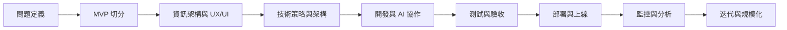

# 標準且符合業界實務的網站開發流程學習指南

副標：從 MVP 到規模化，AI 時代版

更新日期：2026-03-24

---

## 這份指南的定位

這不是一份只教你「怎麼把網站做出來」的筆記，而是一份要幫你建立**完整業界開發思維**的手冊：

- 你會學到怎麼從問題定義、MVP 切分、設計、技術選型、開發、測試、上線，到後續營運與規模化。
- 你會學到在 AI 時代，如何讓 AI 真正提升效率，而不是把錯誤放大得更快。
- 你會學到網站開發不只是前端畫頁面，而是產品、設計、工程、資料、營運共同作用的結果。

本指南整合了官方與高品質實務資源，並加上可直接落地的流程、清單、模板與判斷原則，讓你不只知道「做什麼」，也知道「先做什麼、為什麼、做到什麼程度才算過關」。

---

## 目錄

1. [先建立正確觀念](#1-先建立正確觀念)
2. [網站開發的標準流程總覽](#2-網站開發的標準流程總覽)
3. [第 0 階段：問題定義與需求發現](#3-第-0-階段問題定義與需求發現)
4. [第 1 階段：MVP 切分與範圍控制](#4-第-1-階段mvp-切分與範圍控制)
5. [第 2 階段：資訊架構、內容與 UX/UI](#5-第-2-階段資訊架構內容與-uxui)
6. [第 3 階段：技術策略與架構設計](#6-第-3-階段技術策略與架構設計)
7. [第 4 階段：AI 時代的實作流程](#7-第-4-階段ai-時代的實作流程)
8. [第 5 階段：測試、驗收與品質保證](#8-第-5-階段測試驗收與品質保證)
9. [第 6 階段：安全、隱私、權限與風險控制](#9-第-6-階段安全隱私權限與風險控制)
10. [第 7 階段：效能、可及性、SEO 與觀測性](#10-第-7-階段效能可及性seo-與觀測性)
11. [第 8 階段：CI/CD、部署與營運](#11-第-8-階段cicd部署與營運)
12. [從 MVP 走向規模化](#12-從-mvp-走向規模化)
13. [網站類型與技術取向速查](#13-網站類型與技術取向速查)
14. [學習路線建議：從入門到業界可用](#14-學習路線建議從入門到業界可用)
15. [常見失誤與反模式](#15-常見失誤與反模式)
16. [交付物、清單與模板](#16-交付物清單與模板)
17. [參考資源與延伸閱讀](#17-參考資源與延伸閱讀)

---

## 1. 先建立正確觀念

### 1.1 網站開發不是把頁面做出來而已

一個成熟的網站開發流程，至少同時包含四條線：

- **產品線**：你要解決誰的什麼問題，成功怎麼衡量。
- **設計線**：資訊架構、操作流程、介面、文案、品牌與可用性。
- **工程線**：前後端、資料、部署、測試、監控、資安。
- **營運線**：流量、SEO、分析、回饋、實驗、客服、迭代。

很多初學者只看到工程線，所以容易把「做得出頁面」誤認為「完成網站開發」。

真正業界實務要問的是：

- 誰會用？
- 他為什麼要用？
- 他最重要的任務是什麼？
- 成功是否可量測？
- 上線後如何知道它表現得好不好？

### 1.2 MVP 不是半成品，而是最小可驗證價值

MVP（Minimum Viable Product）的重點不是「簡陋」，而是：

- 只保留最能驗證價值的核心流程。
- 盡快上線取得真實回饋。
- 把時間花在學習市場，而不是過早最佳化。

一個好的 MVP 應該具備：

- 有明確對象。
- 有清楚核心任務。
- 有可完成的關鍵流程。
- 有可量測的結果。
- 有後續迭代空間。

### 1.3 AI 時代的核心原則

AI 已經是網站開發流程的一部分，但它不是替代思考，而是放大系統能力。根據 DORA 2025 方向，AI 更像是**放大器**：流程清楚、文件完整、測試扎實、平台穩定的團隊，會被放大成更高效率；流程混亂、規格模糊、測試缺失的團隊，也會被放大成更快的混亂。

因此 AI 時代的正確姿勢是：

- **人負責判斷，AI 負責加速**。
- **文件先行，才有高品質上下文**。
- **小批次交付，避免一次生成太多不可控變更**。
- **所有 AI 產出都必須可驗證**。
- **越高風險的領域，越不能只靠 AI 直出**。

### 1.4 AI 該做什麼，人該做什麼

**更適合交給 AI 的工作**

- 草擬需求整理與會議摘要
- 生成功能拆解清單
- 建立初版資料結構與 API 草稿
- 產生樣板程式碼、測試骨架、文件初稿
- 做重構建議、除錯方向、PR 說明、發布說明

**必須由人主導的工作**

- 問題定義與價值判斷
- 優先順序與取捨
- 商業規則與邊界條件
- 安全、權限、金流、法規、隱私決策
- 驗收標準與最終品質判定

### 1.5 先求對，再求快；先求可用，再求完整

如果只記一條原則，請記這句：

**先把最重要的一條使用者路徑做對，然後再擴充。**

這會直接影響你怎麼切 MVP、怎麼寫需求、怎麼設計架構、怎麼讓 AI 幫你，而不是被 AI 帶著亂跑。

---

## 2. 網站開發的標準流程總覽

可以把一個成熟的網站開發流程理解成下面這條主線：



### 2.1 每個階段到底要產出什麼

| 階段 | 核心目標 | 主要產出 | 通過條件 |
|---|---|---|---|
| 問題定義 | 找到真正要解決的問題 | 一頁式產品簡述、目標使用者、成功指標 | 團隊對目標一致 |
| MVP 切分 | 聚焦最小可驗證價值 | Must/Should/Could/Won't、核心流程圖 | 範圍足夠小但能驗證 |
| UX/UI | 把功能變成可操作流程 | Sitemap、Wireframe、狀態設計、文案草案 | 主要任務可走通 |
| 技術設計 | 降低後續返工成本 | 技術選型、架構圖、資料模型、API 合約、ADR | 風險與取捨已說清楚 |
| 開發 | 以小批次做出可驗證功能 | 程式碼、文件、PR、測試 | 功能符合驗收條件 |
| 驗收 | 控品質與降風險 | 測試結果、驗收紀錄、缺陷清單 | 可發布且風險可接受 |
| 部署 | 安全穩定上線 | CI/CD、部署流程、回滾方案 | 能部署、能回滾、能監控 |
| 營運 | 持續提升結果 | 監控面板、事件追蹤、回饋與迭代計畫 | 能看見真實成效 |

### 2.2 什麼叫「符合業界實用」

所謂符合業界實用，不是把流程弄得很重，而是：

- 該有的交付物有，但保持輕量。
- 需求、設計、工程與營運可以銜接。
- 功能可以被驗證、被回滾、被追蹤。
- 有基本品質門檻，而不是靠上線後碰運氣。

---

## 3. 第 0 階段：問題定義與需求發現

### 3.1 開始之前先問五個問題

在還沒決定技術棧以前，先回答：

1. 這個網站的主要使用者是誰？
2. 他最痛的問題是什麼？
3. 他願意為什麼結果留下來、註冊、購買或持續使用？
4. 第一版最重要的一條流程是什麼？
5. 成功要用哪些指標判斷？

如果這五個問題答不出來，AI 只會幫你更快做出方向不明的東西。

### 3.2 一頁式產品簡述應包含什麼

最實用的做法不是一開始就寫很厚的規格，而是先做一頁式產品簡述。

至少要有：

- 產品目標
- 目標使用者
- 核心問題
- 核心價值主張
- 主要使用情境
- MVP 範圍
- 明確不做的事
- 成功指標
- 已知風險與限制

### 3.3 成功指標不要只寫「流量成長」

好的指標要能對應產品目的。常見分成兩類：

- **產品結果指標**：註冊率、轉換率、下單率、留存率、完成任務率、詢問單量、客服工單量
- **工程品質指標**：頁面速度、錯誤率、部署頻率、修復時間、測試穩定度

### 3.4 從一開始就做需求分層

需求可分三層：

- **使用者需求**：使用者想完成什麼
- **業務需求**：公司想得到什麼結果
- **技術需求**：效能、安全、穩定、可維護性要求

三者沒有對齊，就會出現：

- 使用者能點，但不能完成任務
- 商業想成長，但工程做不出可量測數據
- 功能做完了，但後續維護成本過高

---

## 4. 第 1 階段：MVP 切分與範圍控制

### 4.1 MVP 切分的正確方式：切垂直，不切水平

常見錯法是：

- 先把前端框架搭好
- 再把設計系統做滿
- 再把後端基礎設施做大
- 最後才發現核心流程還沒跑通

更好的做法是切**垂直切片（Vertical Slice）**：

- 先完成一條從頁面到 API、從資料到回饋都能走通的核心流程。

例如會員網站的第一條核心切片可能是：

- 訪客進站
- 看懂價值主張
- 註冊登入
- 完成一個最核心操作
- 看見成功回饋

### 4.2 MVP 範圍控制法：MoSCoW

- `Must Have`：沒有它就無法驗證核心價值
- `Should Have`：重要，但不是第一版生死線
- `Could Have`：加分項
- `Won't Have`：本階段明確不做

範圍管理最重要的不是「列很多功能」，而是敢把東西排除。

### 4.3 MVP 的驗收標準

MVP 上線前至少要達到：

- 主要流程可完成
- 核心資料正確
- 基本錯誤有處理
- 基本安全與權限有做
- 有最小監控與分析
- 有明確成功指標

### 4.4 Definition of Ready：功能開始做之前

一個功能在進入開發前，至少應該已經具備：

- 問題陳述清楚
- 目標使用者清楚
- 驗收條件清楚
- 設計稿或流程說明足夠清楚
- 相依系統已知
- 風險已知
- 是否需要追蹤事件已知

如果這些沒有先準備好，就很容易進入「邊做邊猜」。

---

## 5. 第 2 階段：資訊架構、內容與 UX/UI

### 5.1 先做資訊架構，再做視覺

網站不是一張首頁圖，而是一套資訊與任務結構。

先釐清：

- 主要頁面有哪些
- 這些頁面彼此如何連結
- 使用者從哪裡進來
- 要去哪裡完成任務
- 哪些頁面是公開頁
- 哪些頁面要登入

常見交付物：

- Sitemap
- User Flow
- 主要頁面 Wireframe
- 重要狀態設計

### 5.2 不只設計成功畫面，也要設計狀態

成熟的網站設計，至少要包含這些狀態：

- Loading
- Empty
- Error
- Success
- Permission denied
- Offline 或弱網路狀態

很多產品在設計稿看起來很完整，但實際使用一出錯就崩，是因為只設計了「理想流程」。

### 5.3 內容設計很重要

使用者常常不是卡在功能，而是卡在文案不清楚。

要提早定義：

- 導覽名稱是否好懂
- 按鈕文案是否明確
- 表單欄位名稱是否清楚
- 錯誤訊息是否能指引下一步
- 空狀態是否有引導

### 5.4 響應式設計不是最後補

應從一開始就決定：

- 手機優先還是桌機優先
- 關鍵斷點如何設計
- 導覽、表單、表格、卡片在小螢幕怎麼變形
- 圖片、字級、互動區域是否適合觸控

### 5.5 可及性應在設計階段納入

可及性不是只給大公司用，而是所有成熟網站都應該有的基本門檻。

設計時就應考慮：

- 色彩對比
- 鍵盤操作流程
- 焦點樣式
- 表單標籤
- 圖片替代文字需求
- 字級與可讀性
- 影音字幕與說明

---

## 6. 第 3 階段：技術策略與架構設計

### 6.1 技術選型先看目標，不先看流行

技術選型要看的是：

- 這是內容導向網站還是互動導向網站
- SEO 是否重要
- 團隊是否熟悉
- 是否需要快速招人接手
- 是否有即時互動、權限、複雜狀態
- 是否需要多語、CMS、電商、搜尋、會員、後台
- 預算、維運能力、部署環境是什麼

### 6.2 常見渲染模式怎麼選

| 情境 | 較適合的取向 |
|---|---|
| 品牌官網、內容站、SEO 優先 | MPA、SSR、SSG |
| 內容很多但又要部分互動 | Hybrid（內容頁 SSR/SSG，互動頁局部客戶端） |
| 登入後台、儀表板、內部工具 | SPA 或 Hybrid |
| 電商、內容與轉換都重要 | SSR 或 Hybrid |
| 極簡活動頁或單頁 Landing Page | SSG 或 MPA |

沒有一種架構永遠最好，只有對當前目標最合適。

### 6.3 架構的核心原則

成熟架構通常遵守：

- 表現層、業務層、資料層分離
- 重要商業規則集中管理
- API 合約清楚
- 配置與環境分離
- 錯誤可追蹤
- 變更可回滾

### 6.4 從一開始就定義資料與權限

你至少要想清楚：

- 核心實體有哪些
- 哪些資料是公開的，哪些要登入才能看
- 哪些動作需要權限
- 哪些資料要保留歷史
- 是否需要審計紀錄

如果資料與權限沒有先想清楚，後面通常會在 API 設計、後台管理、風險控制和測試上反覆返工。

### 6.5 用 ADR 管理重要決策

ADR（Architecture Decision Record）不需要很長，但要記錄：

- 問題是什麼
- 你考慮了哪些方案
- 為什麼選這個方案
- 有哪些代價
- 之後什麼情況要重看這個決策

這對 AI 時代尤其重要，因為 AI 很需要穩定且可追蹤的上下文。

### 6.6 12-Factor 思維仍然重要

即使工具變了，許多現代網站與 SaaS 仍受益於這些原則：

- 單一代碼庫對應多個部署環境
- 依賴明確宣告
- 設定與程式碼分離
- 開發、測試、正式環境盡量接近
- 日誌視為事件流
- 背景工作與管理腳本可獨立執行

這些原則能直接提升可部署性、可維護性與團隊協作效率。

---

## 7. 第 4 階段：AI 時代的實作流程

### 7.1 業界實用的 Git/PR 節奏

最實用的做法通常是：

1. 從主幹建立短生命週期分支
2. 只做一件相關的變更
3. 小批次提交
4. 發 PR，說清楚問題、方案、風險與測試方式
5. 經過 review 與自動檢查後再合併
6. 合併後刪除分支

這類 branch-based workflow 非常適合 AI 協作，因為：

- 變更範圍更小，AI 更容易理解上下文
- review 更容易發現問題
- 回滾更容易

### 7.2 Commit 與 PR 要求

好的 Commit：

- 只做一件事
- 名稱清楚
- 可回滾

好的 PR：

- 說清楚為什麼改
- 說清楚改了什麼
- 說清楚風險在哪
- 說清楚怎麼驗證
- 有必要時附上截圖、影片或流程圖

### 7.3 AI 協作的標準循環

最穩定的人機協作流程通常是：

1. 人定義任務與上下文
2. AI 協助拆解與提出方案
3. 人選定範圍與驗收標準
4. AI 產出第一版
5. 人審查、測試、修正方向
6. AI 協助補強測試、文件、重構
7. 人做最終驗收

### 7.4 高品質 Prompt 的結構

AI 品質很大程度取決於上下文品質。有效 Prompt 通常包含：

- 背景與目標
- 現況與限制
- 現有檔案或模組
- 明確不該動的範圍
- 驗收條件
- 期望輸出格式

### 7.5 文件就是 AI 的上下文基礎設施

AI 時代更需要把下面這些文件維持乾淨：

- README
- 架構說明
- API 合約
- ADR
- 設計規範
- 常見流程與 runbook
- 測試策略

因為 AI 若讀到的是模糊、過時、矛盾的文件，就會把錯誤理解複製到更多地方。

### 7.6 哪些任務不能只靠 AI 直出

這些領域務必提高人工審查強度：

- 認證與授權
- 金流與交易
- 刪除資料
- 權限升降
- 資料庫 migration
- 併發與一致性
- 加密、金鑰與 secrets
- 法規、隱私、個資處理

### 7.7 AI 時代最實用的工作方式：小批次、可驗證、留痕跡

不要一次丟給 AI 一個含糊的大任務，例如：

- 幫我做完整會員系統
- 幫我把整個網站重構成最新架構

更好的方式是：

- 先整理現況
- 先拆成一小塊
- 先定義通過標準
- 一次只改一段流程
- 每一步都有 review 與驗證

---

## 8. 第 5 階段：測試、驗收與品質保證

### 8.1 品質不是測試部門的事

成熟團隊的品質是「流程內建」，不是最後補救。

基本品質層次通常包含：

- 靜態品質：格式、Lint、型別、規格一致性
- 單元測試：邏輯函式、商業規則
- 整合測試：API、資料庫、第三方整合
- E2E 測試：主要使用者流程
- 手動驗收：體驗、視覺、文案、真實操作感

### 8.2 什麼應該優先自動化

先自動化這些最划算：

- 容易壞且常改的核心邏輯
- 登入、註冊、下單、提交表單等關鍵流程
- 曾經出過事故的地方
- 跨頁面或跨服務的整合流程

### 8.3 測試金字塔仍然適用

```text
大量：Unit Tests
中量：Integration Tests
少量：E2E Tests
必要時：人工探索測試
```

不要把所有信心都壓在 E2E，因為它最慢、最脆弱、除錯成本最高。

### 8.4 E2E 的實用原則

以 Playwright 的最佳實務來看，E2E 最重要的是：

- 測試使用者看得見的行為，而不是實作細節
- 每個測試彼此隔離
- 只測你能控制的系統
- 優先使用對使用者可見的定位方式

這樣測試才比較穩、比較接近真實價值，也比較不會因為 UI 微調就大量壞掉。

### 8.5 驗收不要只驗功能有沒有動

驗收至少還要看：

- 錯誤狀態是否合理
- 手機與桌機是否都正常
- 載入速度是否可接受
- 表單是否容易用
- 權限是否正確
- 事件追蹤是否有埋
- SEO 需要的標題、描述、結構是否到位

### 8.6 Definition of Done：什麼叫真的完成

功能完成不等於「能跑就算」。

較成熟的 Done 應至少包含：

- 功能符合驗收條件
- 程式碼已 review
- 測試通過
- 重要邊界條件有處理
- 文件已更新
- 分析事件已補齊
- 有回滾或補救方式

---

## 9. 第 6 階段：安全、隱私、權限與風險控制

### 9.1 安全要當成需求，不是事後補丁

對網站開發而言，最實用的安全觀念是：

- 先從 OWASP Top 10 做基本風險意識
- 用 OWASP ASVS 做需求與驗收基線

如果產品涉及金流、會員、個資、後台、檔案上傳、API、公眾流量，就不能把安全當成可選項。

### 9.2 最基本的安全檢查清單

- 所有輸入都驗證
- 所有輸出都正確轉義
- 認證與授權分清楚
- 密碼安全儲存
- Secret 不進版控
- 重要操作有審計紀錄
- 需要時做 rate limit
- 依賴套件定期更新
- 檔案上傳要驗副檔名、MIME、大小與掃毒策略

### 9.3 權限控制常見錯誤

常見問題不是「沒做登入」，而是：

- 登入了卻沒驗是否有權限
- 前端隱藏按鈕，但後端沒檢查
- 角色權限與資料範圍混在一起
- 管理後台沒有審計紀錄

### 9.4 隱私與資料治理

若網站蒐集使用者資料，至少要定義：

- 蒐集哪些資料
- 為什麼要蒐集
- 保存多久
- 誰可以看到
- 使用者如何查詢、匯出、刪除
- Cookie 與追蹤如何告知

### 9.5 風險越高，流程越要加護欄

以下場景建議提高審查與驗證：

- 金流
- 訂單
- 庫存
- 權限
- 個資
- 法規要求領域
- AI 生成內容直接對外發佈

---

## 10. 第 7 階段：效能、可及性、SEO 與觀測性

這四項是成熟網站的共同品質，不應等到最後才補。

### 10.1 效能：先訂預算，再談優化

效能管理建議從「預算」開始，而不是感覺。

至少要定義：

- 首頁與關鍵頁可接受的載入時間
- JS bundle 目標大小
- 圖片策略
- 字型策略
- 首屏渲染重點

Core Web Vitals 可作為實用基線：

- LCP：建議在 2.5 秒內
- INP：建議在 200 毫秒內
- CLS：建議在 0.1 以內

常見優化重點：

- 圖片壓縮與現代格式
- lazy loading
- code splitting
- 減少阻塞資源
- 快取策略
- CDN
- 避免過量第三方腳本

### 10.2 可及性：預設以 WCAG 2.2 AA 為目標

最實用的基線做法：

- 優先使用語意化 HTML
- 所有互動都可鍵盤操作
- 焦點可見
- 表單有 label、提示與錯誤說明
- 圖片有適當 alt
- 色彩對比達標
- 影片有字幕，重要音訊有文字替代
- ARIA 是補強，不是拿來代替正確 HTML

### 10.3 SEO：先做使用者價值，再做搜尋可理解性

SEO 的本質不是技巧堆疊，而是：

- 內容對人有價值
- 結構對搜尋引擎可理解

最基本的 SEO 清單：

- 網站結構合理
- URL 清楚可讀
- 頁面標題唯一且準確
- Meta description 合理
- 內部連結清楚
- 圖片 alt 與內容相關
- Canonical、Sitemap、robots.txt 正確
- 公開頁對搜尋引擎可抓取
- 內容有幫助、可靠、更新

如果你的網站是公開型網站，SEO 不是行銷才要管，而是技術與內容要一起處理。

### 10.4 觀測性：上線後要看得見

沒有觀測性，就只是把產品丟到線上。

至少應有：

- 結構化日誌
- 錯誤追蹤
- 延遲、錯誤率、流量等指標
- 關鍵使用者事件追蹤
- 轉換漏斗
- 警示與通知

網站常見要追的產品事件：

- 首次到站
- 註冊開始
- 註冊成功
- 表單提交
- 加入購物車
- 開始結帳
- 完成購買
- 關鍵 CTA 點擊

---

## 11. 第 8 階段：CI/CD、部署與營運

### 11.1 沒有自動化，就很難穩定

成熟網站至少應有基本 pipeline：

1. 安裝依賴
2. Lint / Format 檢查
3. 型別檢查
4. 單元測試
5. Build
6. 整合或 E2E 測試
7. Preview / Staging 驗證
8. 部署到正式環境

### 11.2 環境規劃最少要有三層

- `local`：個人開發
- `staging`：接近正式、做驗收與測試
- `production`：正式服務

這三層越接近，越能減少「本機沒問題，上線爆掉」。

### 11.3 上線前要有回滾方案

每次部署前都應該知道：

- 怎麼快速回上一版
- DB migration 是否可逆
- 功能是否可以用 feature flag 控制
- 第三方設定是否同步
- 出事誰負責看警示

### 11.4 Runbook 比想像中重要

至少寫下：

- 部署流程
- 回滾流程
- 常見故障處理
- 例行維運工作
- 外部依賴異常時怎麼應對

AI 也很適合協助整理 runbook，但最後一定要由人確認可操作性。

### 11.5 上線不是結束，而是新循環起點

上線後至少要做：

- 確認關鍵頁與流程正常
- 查看錯誤與告警
- 對照流量與轉換是否異常
- 收集真實使用回饋
- 把結果帶回下一輪迭代

---

## 12. 從 MVP 走向規模化

### 12.1 什麼時候該從 MVP 升級

出現以下訊號時，表示該進入下一層：

- 流量明顯上升
- 核心流程穩定被使用
- 需求持續增加
- 系統開始出現瓶頸
- 維護成本明顯提高
- 團隊成員增加，需要更高協作效率

### 12.2 規模化優先順序

不要一開始就衝微服務。通常更划算的順序是：

1. 補監控與告警
2. 補測試與 CI
3. 補快取與 CDN
4. 優化資料查詢與索引
5. 把背景任務與同步任務拆開
6. 補權限與審計
7. 模組化、邊界清楚化
8. 最後才評估服務拆分

### 12.3 規模化不只技術，也包括流程

當團隊變大，你還需要：

- 明確 code ownership
- ADR 與設計決策紀錄
- 統一 PR 規範
- 發版與 incident 流程
- 文件治理
- 平台與工具標準化

### 12.4 AI 時代的規模化關鍵：平台與護欄

當多人都在用 AI 開發時，真正影響速度與品質的，不只是模型本身，而是：

- 專案文件是否完整
- 開發環境是否容易啟動
- 測試與 CI 是否可靠
- PR 與 review 是否有清楚標準
- 是否有統一的設計系統、元件、範例與範本

這些就是 AI 時代的「平台能力」。

---

## 13. 網站類型與技術取向速查

| 網站類型 | 主要目標 | 優先關注 | 常見取向 |
|---|---|---|---|
| 品牌官網 | 傳達價值、蒐集名單 | SEO、內容、設計、效能 | MPA / SSR / SSG |
| 內容網站 | 穩定發佈與搜尋流量 | SEO、CMS、分類、內部連結 | SSG / SSR / CMS |
| SaaS / Web App | 完成任務與留存 | 認證、權限、資料流、觀測性 | SPA / Hybrid |
| 電商網站 | 商品發現與轉換 | SEO、搜尋、效能、結帳、庫存 | SSR / Hybrid |
| 內部工具 | 提高作業效率 | 權限、審計、速度、維護性 | SPA / Hybrid |

---

## 14. 學習路線建議：從入門到業界可用

### 第 1 層：Web 基礎層

目標：把網頁做對。

你應學會：

- HTML、CSS、JavaScript 基礎
- RWD
- 表單、語意化標記
- DOM 與基礎 API
- Git 基本操作

### 第 2 層：網站產品層

目標：把一個完整網站做出來。

你應學會：

- 前端框架
- 路由、狀態管理
- API 串接
- 後端、資料庫、認證
- 基本部署
- 基本分析與 SEO

### 第 3 層：業界工程層

目標：把網站做得可維護、可上線、可協作。

你應學會：

- 架構分層
- 測試策略
- CI/CD
- 權限與安全
- 效能、可及性、觀測性
- PR / review / branch workflow

### 第 4 層：AI 原生開發層

目標：把 AI 變成穩定生產力。

你應學會：

- 任務拆解
- Prompt 結構化
- AI 產出驗證
- 用文件提供上下文
- 小批次迭代
- 高風險場景的人機分工

---

## 15. 常見失誤與反模式

- 一開始就想做完整產品，而不是可驗證 MVP
- 先堆技術，後補需求
- 設計只做成功畫面，不做狀態
- 沒有 API 合約與資料邊界
- PR 過大，review 形同虛設
- 把 SEO、可及性、效能當最後補強
- 只有功能測試，沒有錯誤與權限測試
- 只追求 AI 產出速度，不做驗證
- 文件過時，AI 與新成員都被誤導
- 沒有 staging、沒有回滾、沒有警示就上線

---

## 16. 交付物、清單與模板

### 16.1 最小交付物清單

| 類型 | 最小交付物 |
|---|---|
| 產品 | 一頁式產品簡述、MVP 範圍、成功指標 |
| 設計 | Sitemap、核心流程圖、Wireframe、重要狀態設計 |
| 工程 | 技術選型說明、API 合約、資料模型、ADR |
| 品質 | 測試策略、驗收清單 |
| 營運 | 事件追蹤表、部署清單、回滾方案、監控面板 |

### 16.2 一頁式產品簡述模板

```text
產品名稱：
目標使用者：
核心問題：
核心價值主張：
第一版核心流程：
MVP 一定要有：
第一版明確不做：
成功指標：
主要風險：
```

### 16.3 功能規格模板

```text
功能名稱：
要解決的問題：
使用者情境：
觸發條件：
主要流程：
錯誤情境：
權限規則：
追蹤事件：
驗收條件：
```

### 16.4 AI 協作 Prompt 模板

```text
背景：
目前專案是什麼、目標是什麼。

現況：
目前已有哪些頁面、模組、文件或限制。

任務：
這次只要完成哪一小塊。

限制：
哪些檔案可動、哪些不可動、要遵守哪些規則。

驗收條件：
完成後必須達到哪些結果。

輸出格式：
我要的是方案、文件草稿、程式碼、測試，還是 review 建議。
```

### 16.5 PR 說明模板

```text
## Why
這個變更要解決什麼問題

## What
做了哪些改動

## Risk
可能影響什麼

## Test Plan
我怎麼驗證這個改動

## Notes
需要 reviewer 特別注意的地方
```

### 16.6 發版前檢查清單

- 關鍵流程是否已驗收
- CI 是否全綠
- 環境變數是否確認
- 資料庫變更是否已驗證
- 監控與警示是否就緒
- 回滾方案是否明確
- SEO / a11y / analytics 是否完成最小要求

---

## 17. 參考資源與延伸閱讀

以下資源為本指南整合時主要參考的高品質來源。檢索與整理日期為 **2026-03-24**。

### Web 基礎與學習路徑

- MDN Learn Web Development  
  <https://developer.mozilla.org/en-US/docs/Learn_web_development>  
  適合建立 HTML、CSS、JavaScript、版本控制、測試、可及性等基礎。

- MDN Accessibility  
  <https://developer.mozilla.org/en-US/docs/Learn_web_development/Core/Accessibility>  
  幫助把可及性納入日常開發流程，而不是事後補強。

### 效能與使用者體驗

- web.dev Learn Performance  
  <https://web.dev/learn/performance/>  
  適合建立網站效能的核心觀念與實作方法。

- web.dev Core Web Vitals  
  <https://web.dev/articles/vitals>  
  提供 LCP、INP、CLS 等實用效能基線。

### SEO 與公開網站可發現性

- Google Search Central SEO Starter Guide  
  <https://developers.google.com/search/docs/fundamentals/seo-starter-guide>  
  適合做公開網站、內容網站、品牌網站與電商網站的 SEO 基礎。

### Git、協作與 PR 流程

- GitHub Flow  
  <https://docs.github.com/en/get-started/using-github/github-flow>  
  適合建立輕量、清楚、可 review 的分支工作流。

- About Pull Request Reviews  
  <https://docs.github.com/en/pull-requests/collaborating-with-pull-requests/reviewing-changes-in-pull-requests/about-pull-request-reviews>  
  適合建立 review、批准、變更要求與保護分支規範。

### 測試

- Playwright Best Practices  
  <https://playwright.dev/docs/best-practices>  
  適合建立 E2E 測試策略，特別是使用者可見行為、測試隔離與穩定定位方式。

### 安全與驗證標準

- OWASP Application Security Verification Standard (ASVS)  
  <https://owasp.org/www-project-application-security-verification-standard/>  
  適合用來建立網站安全需求與驗收基線。依 OWASP 頁面，最新穩定版為 **5.0.0**。

- OWASP Top Ten Web Application Security Risks  
  <https://owasp.org/www-project-top-ten/>  
  適合建立基本網站安全風險意識。依 OWASP 頁面，最新釋出版本為 **2025**。

### 可及性標準

- W3C WCAG 2 Overview  
  <https://www.w3.org/WAI/standards-guidelines/wcag/>  
  作為可及性標準與對照基線，實務上常以 WCAG 2.2 AA 作為預設目標。

### 架構與維運

- The Twelve-Factor App  
  <https://12factor.net/>  
  雖然不是新文件，但對 SaaS、Web App、雲端部署思維仍然非常實用。

- Google Cloud / DORA DevOps Capabilities  
  <https://docs.cloud.google.com/architecture/devops>  
  適合從技術、流程、文化三個面向看待高效能軟體交付能力。

- Google Cloud DevOps / DORA  
  <https://cloud.google.com/solutions/devops/devops-four-key-metrics>  
  可用來理解現代 DevOps 與 AI 時代下，速度、穩定性、平台與流程之間的關係。

---

## 最後總結

真正標準且符合業界實用的網站開發流程，不是把流程做重，而是把事情做對：

- 用 MVP 驗證價值
- 用設計與內容讓流程可用
- 用工程與測試讓系統可靠
- 用安全、可及性、SEO、效能與觀測性讓產品成熟
- 用 CI/CD 與文件讓團隊可持續協作
- 用 AI 放大清楚的流程，而不是放大混亂

如果你之後要把這份指南再往下深化，最好的方向不是再塞更多工具名稱，而是把它進一步對應到你自己的實際專案：

- 你的網站類型是什麼
- 你的核心流程是什麼
- 你的品質門檻是什麼
- 你的團隊與 AI 協作模式是什麼

當這四件事開始清楚，網站開發就不再只是「學技術」，而會變成一套真正能持續交付價值的工作系統。
