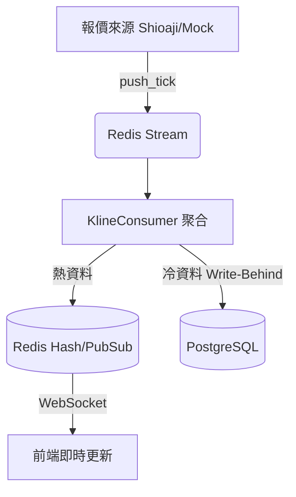
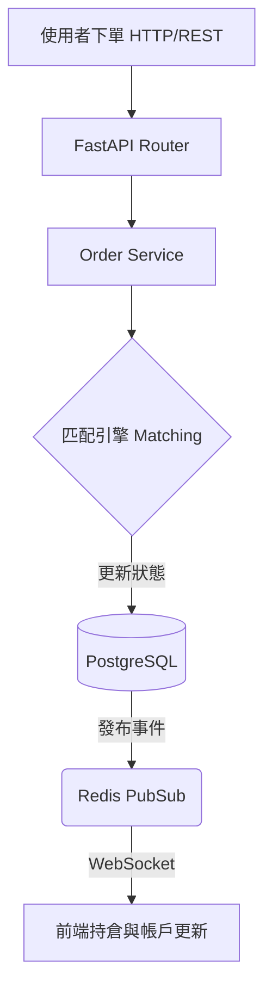

# 完整開發流程學習指南 (AI 時代實質精通版)

以本專案（台股當沖模擬交易系統）為實例，記錄從 MVP (Minimum Viable Product) 精神到深入規模化 (Scalable) 的完整現代網站開發思路。本指南特別融入了「AI 時代的開發思維」與 Vibe Coding 模式下的人機協作流程，做為標準且符合業界實務的參考。

---

## 目錄

1. [核心精神：AI 時代的 MVP 到規模化開發](#1-核心精神ai-時代的-mvp-到規模化開發)
2. [專案目標與需求分析框架](#2-專案目標與需求分析框架)
3. [架構設計與技術選型：為擴展做準備](#3-架構設計與技術選型為擴展做準備)
4. [開發心態與分層實作：由內而外](#4-開發心態與分層實作由內而外)
5. [AI 協作開發實務：Vibe Coding 模式](#5-ai-協作開發實務vibe-coding-模式)
6. [測試策略與品質保證：AI 輔助的測試金字塔](#6-測試策略與品質保證ai-輔助的測試金字塔)
7. [安全性實務：保護應用程式](#7-安全性實務保護應用程式)
8. [使用者體驗 (UX) 與錯誤處理實務](#8-使用者體驗-ux-與錯誤處理實務)
9. [Debug 方法論：縮小範圍找根因](#9-debug-方法論縮小範圍找根因)
10. [邁向規模化：API 設計、效能與監控](#10-邁向規模化api-設計效能與監控)
11. [團隊協作與 CI/CD DevOps](#11-團隊協作與-cicd-devops)
12. [附錄：快速參考與設計原則速記](#12-附錄快速參考與設計原則速記)

---

## 1. 核心精神：AI 時代的 MVP 到規模化開發

### 1.1 什麼是 AI 時代的開發思維？
在傳統開發中，開發者需要手動處理大量樣板程式碼 (Boilerplate) 與重複性工作。而在 AI 時代：
- **AI 作為開發引擎 (Copilot/Claude/GPT)**：負責產生重複性高、具備既定模式的程式碼片段。
- **開發者轉型為「架構師」與「引航員」**：將精力集中於定義清晰的業務邏輯、邊界條件考量、系統架構設計，以及審閱 AI 產出的結果是否符合需求（Vibe Coding）。
- **工具鏈整合**：自動化腳本、測試案例生成、API 文檔撰寫等都可以藉助 AI 快速完成。

### 1.2 MVP (Minimum Viable Product) 精神與迭代策略
業界實用的網站開發標準，從不追求「一次到位」，而是「快速驗證、持續迭代」。

- **MVP 階段 (驗證核心價值)**：
  - 目標：用最少的成本、最快速度將核心功能推向市場，以測試使用者反饋。
  - 做法：捨棄邊緣功能 (Edge Cases 初步透過限制處理)、簡化架構 (例如單體式架構 Monolith)，優先打通「最重要的一條使用者路徑」。
  - AI 加速：透過 ChatGPT/Claude 產出功能 Prototype 或 Midjourney/Uizard 產生 UI 設計稿，迅速將概念具體化。

- **規模化 (Scalling) 階段 (技術債償還與擴展)**：
  - 目標：當 MVP 驗證成功且流量上升時，確保系統穩定性與擴展性。
  - 做法：導入微服務/解耦架構、強化快取策略、資料庫讀寫分離、實作 CI/CD 與建置完整的監控告警機制。

---

## 2. 專案目標與需求分析框架

任何專案在動手寫程式碼前，都必須要有清晰的目標與需求定義。這是引導 AI 產生正確架構的基礎。

### 2.1 專案目標 (Goals)
清楚定義這個產品「要解決什麼問題」、「為誰服務」，以及「成功的定義是什麼」。

*(以本專案為例)*：
- **核心痛點**：投資人需要一個擬真的環境練習台股當沖技巧，但市面上的虛擬交易系統無法完全反映真實市場的跳動點、滑價及手續費。
- **專案目標**：打造一個具備即時報價、精準撮合邏輯（考慮真實 tick size 與內外盤深度）、且無延遲的高效能台股當沖模擬交易平台。

### 2.2 業務需求 (Business Requirements)
以使用者故事 (User Story) 的方式，描述系統應該具備什麼商業功能，並決定優先級 (MVP 範圍)。

*(MVP 首日上線範圍)*：
- `Must Have`: 註冊/登入系統 (JWT)、即時報價接收與顯示 (K線圖)、市價/限價單下單功能、簡單的帳戶餘額與持倉顯示。
- `Should Have`: 考慮台股實際跳動點與手續費/證交稅計算的撮合引擎。
- `Could Have`: OCO 止盈止損單（可於 MVP 驗證後第二階段加入）。
- `Won't Have`: 複雜的排行榜或社交分享功能（MVP 不考慮）。

### 2.3 技術需求 (Technical Requirements)
定義系統在非功能性 (Non-functional) 方面的承諾，這會直接影響架構設計。

*(以本專案為例)*：
- **效能**：下單到撮合完成的延遲需在 50ms 以內，前端報價更新需達到即時 (WebSocket)。
- **可用性/擴展性**：後端需支援無狀態 (Stateless) 以利於水平擴展 (Horizontal Scaling)；報價來源解耦，可切換 Mock 或真實 API。
- **資料正確性**：交易牽涉金額，必須防止超賣 (Race Condition) 與精度問題 (使用 `Decimal` 而非 `float`)。

---

## 3. 架構設計與技術選型：為擴展做準備

### 3.1 畫出資料流再寫程式
釐清系統邊界與資料流向，是防止日後架構腐化的關鍵。遇到問題時，拿出這張圖通常就能找出癥結點。

**【報價與 K 線資料流】**（讀多寫少，重視即時性）


**【下單與撮合資料流】**（寫入並重，重視一致性）


### 3.2 面向擴展的技術選型與解耦設計
在 MVP 階段，我們選擇了 FastAPI + Vue3/Nuxt3 的全端組合。雖然目前應用並未拆分成微服務，但**內部模組已做到高度解耦**：
- **純計算層獨立**：核心引擎 (`matching.py`, `fees.py`) 不依賴任何資料庫或 I/O，這讓系統隨時能被抽離成獨立的微服務。
- **無狀態的 Web 層**：JWT Token 驗證取代了 Session，因此 FastAPI 伺服器可以隨時透過 Load Balancer（如 Nginx 或 AWS ALB）水平擴展增加機器。
- **Message Queue 解耦**：利用 Redis Stream 進行非同步推播，未來若需要加入「大數據歷史分析」服務，只需增加一個新的 Consumer，原有的下單系統完全不受影響。

---

## 4. 開發心態與分層實作：由內而外

### 4.1 開發心態：不讀懂就不改
改程式最常見的失誤是「假設自己知道它在做什麼」，結果改了一個地方壞了另外兩個地方。AI 雖然能寫 code，但「系統的整體脈絡」永遠是開發者要掌握的。

**做法：從入口往底層追蹤：**
- **後端入口**：`main.py` (App Initializer) → `routers/` (HTTP 介面) → `services/` (業務邏輯) → `models/` (資料定義)。
- **前端入口**：`app.vue` → `pages/` (路由) → `components/` (UI) → `stores/` (狀態與 API)。

### 4.2 分層開發原則：由內而外
開發新功能時，遵循**由內而外 (Inside-Out)** 的原則，先做不依賴外部的純邏輯，再往外擴展到 API 與 UI。這樣做能夠最高效地利用單元測試 (Unit Test) 防堵錯誤。

#### 後端分層順序：
1. **[第一層] 純計算（最容易測試）**：`engine/tick_size.py`、`engine/fees.py`
2. **[第二層] 模型與介面定義**：`db/models/*.py` (ORM)、`schemas/*.py` (Pydantic 驗證)
3. **[第三層] 業務邏輯組裝**：`services/order_service.py` (調用 DB、觸發計算)
4. **[第四層] 外部進入點（最後寫）**：`routers/*.py` (接收 HTTP 請求)

#### 前端架構與實務：狀態管理與即時更新
交易前端的挑戰在於處理「主動 API 請求」與「被動 WebSocket 推播」。
1. **[第一層] Data Types**：`types/orders.ts`，與後端 Schema 保持絕對一致。
2. **[第二層] State Management (Pinia)**：`stores/market.ts` (純資料流)、`stores/orders.ts` (API 行為)。
3. **[第三層] Dispatcher (WebSocket)**：`ws.ts` 作為中央派發器，不讓 UI 組件直接聽 WebSocket，而是由 `ws.ts` 收到 `tick` 事件後，呼叫 `marketStore.onTick()` 更新狀態。
4. **[第四層] UI Components**：`components/`，只負責視覺渲染與綁定 Store 資料。

### 4.3 資料庫結構變更 (Migration) 紀律
嚴格禁止直接手動修改資料庫 Schema。所有結構變更必須透過 Alembic 進行版控：
```bash
alembic revision --autogenerate -m "add bracket_id to orders" # 生成變更腳本
alembic upgrade head # 套用到資料庫
```
這是從 MVP 走向工業化生產 (Production) 的絕對前提。

---

## 5. AI 協作開發實務：Vibe Coding 模式

### 5.1 什麼是 Vibe Coding？
傳統開發流程通常是以週計的線性流程 (需求 -> 設計 -> 實作 -> 測試)。
AI 時代的 **Vibe Coding** 是以「小時計」的循環：**人類發想 → AI 產出原型 → 人類測試與微調 → AI 重構優化**。

| 角色 | 負責事務 |
|------|----------|
| **開發者 (人類)** | 定義需求與目標、提供清楚的 Context、判斷邊界條件、驗收成果的正確性、決定開發優先順序。 |
| **強 AI (Assistant)** | 閱讀現有程式碼並理解上下文、提供架構設計選項、生成實作程式碼、補齊單元測試、快速找出 Bug 根因。 |

### 5.2 高效人工 Prompt 秘訣 (The Vibe Check)
1. **提供 Context**: 「在這個專案中，我們已經有 `useToast` 和 `orderStore`，請幫我...」
2. **範例導向 (Few-Shot)**: 「請參考 `LightningDom.vue` 的做法，為我們建立一個新的...」
3. **步步為營 (Step-by-Step)**: 「我們先定義後端的 FastAPI Schema，確認無誤後再實作 Service，最後再寫測試。」

### 5.3 實戰優先順序決策框架
在每天的開發中，你將面對無數需要優化的細節，請用以下矩陣決定與 AI 溝通的優先順序：
- 🚀 **高影響 × 低成本**：立刻做（例如：加上 1d K線的 WebSocket 訂閱，只需加一行程式碼）。
- 🔧 **阻塞點修復**：優先處理（例如：測試不通過阻礙後續 CI/CD 流程）。
- 🎯 **核心功能 (MVP 關鍵)**：正常推進（例如：JWT 模組重構）。
- 🏗️ **低影響技術債**：功能穩定後再說（例如：將某個不常變動的查詢語法微優化）。

---

## 6. 測試策略與品質保證：AI 輔助的測試金字塔

MVP 階段可以快，但「核心邏輯不能錯」。我們採用經典的三層測試金字塔：

```
          /\
         /  \
        / e2e \      少量（驗證真實流程）
       /--------\
      /integration\  中量（驗證元件協作與 Redis）
     /--------------\
    /   unit tests   \  大量（驗證純演算法，執行極快）
   /------------------\
```

### 6.1 Unit Tests（單元測試：快且準確）
測量純粹的業務邏輯。**你可以直接請 AI 為 `engine/` 下的所有函數生成完整的單元測試**（含邊界條件）。
```python
def test_tsmc_price():
    # 測試邊界條件：台股 500 元以上 tick 為 1.0
    assert get_tick_size(Decimal("500")) == Decimal("1.0")
```

### 6.2 E2E Tests（端對端測試）
模擬真實使用者的操作流程。
```python
async def test_market_buy_flow(client):
    """測試流程：登入 → 下單 → 確認狀態返回 FILLED → 確認持倉變化"""
    # ...
```
**避坑指南**：在 Python 異步測試 (`pytest-asyncio`) 中，若混用不同的 event loop，會遇到 `Future attached to a different loop` 的極痛錯誤。解法是在 `pyproject.toml` 強制預設 `session` scope。

---

## 7. 安全性實務：保護應用程式

開發實用的系統，安全性是不可妥協的底線。

### 7.1 安全開發三大原則
1. **Defense in Depth（縱深防禦）**：多層防護（前端阻擋 + 後端格式驗證 + 資料庫層級唯一性限制）。
2. **Fail-Safe Defaults（安全預設）**：所有 API 預設為拒絕存取，必須透過 `@Depends(get_current_user)` 明確允許。
3. **Least Privilege（最小權限）**：資料庫用戶只賦予 DML 權限，不給予 DDL 等高危權限。

### 7.2 常見威脅與防禦
- **SQL Injection**：全面使用 SQLAlchemy ORM，禁止字串拼接 SQL。
- **XSS & 資料注入**：前端 Vue 預設轉義，後端強制使用 Pydantic 強型別 `Field(pattern=...)` 驗證。
- **CSRF 攻擊**：採用無狀態的 JWT Bearer Token（存於 Authorization Header），淘汰傳統 Cookie Session 模式。
- **機密外洩**：密碼全面使用 bcrypt 雜湊後儲存，私鑰存放於 `.env` 中且已加入 `.gitignore`。

---

## 8. 使用者體驗 (UX) 與錯誤處理實務

### 8.1 統一反饋機制與錯誤分層
一個成熟的網站必須要有優雅的錯誤處理，讓使用者知道「發生了什麼事」以及「該怎麼辦」。

我們將錯誤處理分為三層：
1. **前端輸入層**：UI 級別的即時阻隔（例如：下單數量輸入負數，按鈕直接 Disable）。
2. **後端 Schema 層**：Pydantic 擋下型別與長度錯誤，自動回傳 422 錯誤。
3. **業務邏輯層**：庫存不足、資金不夠等，由 Service 拋出例外，再由 Router 捕捉轉化為給使用者的 400 `HTTPException`。

**前端的優雅呈現**：
前端攔截 HTTP 錯誤碼，透過 `useToast()` 全域組件顯示友善訊息（Toast Notification），避免讓使用者看到原始的 traceback。

### 8.2 變更狀態的樂觀更新 (Optimistic UI)
在對效能要求極高的場景（例如按下「刪單」按鈕），前端先假設 API 會成功，瞬間將該筆單從畫面上移除 (提供即時反饋)。接著在背景呼叫 API，若 API 失敗回傳錯誤，再將該筆單「默默加回」畫面並跳出錯誤提示。

---

## 9. Debug 方法論：縮小範圍找根因

AI 能幫你寫程式碼，但當系統複雜度提高，Bug 通常藏在架構與環境設置中，人類必須主導 Debug 過程。

### 9.1 標準 Debug 三部曲
1. **看完整錯誤訊息**：絕大多數人只看最後一行的 `Exception`，真正的關鍵往往在 Traceback 的中間（「誰呼叫了誰」）。
2. **尋找最初觸發點**：例如 `sqlalchemy.exc.InvalidRequestError: A transaction is already begun on this Session.`，這表示在程式碼前面的某處不小心多開了一個 `begin()`。
3. **最小重現 (Minimal Reproducible Example)**：不要在牽涉 Redis、DB 和 Nginx 的完整流程中 Debug。把出錯的函式抽出來獨立執行，或者專門跑那一個出錯的單元測試 (`pytest -k test_xxx_function`)。

### 9.2 將 AI 當作 Debug 顧問
當遇到棘手的錯誤訊息時，可以複製完整的 traceback 給 AI，並附上：「這是我的 xxxx 函式，錯誤是在呼叫時發生的。請問這通常是什麼原因？」。AI 能夠迅速點出像是套件版號衝突、async 混用的常見盲點。

---

## 10. 邁向規模化：API 設計、效能與監控

從 MVP 到成熟產品，API 必須正規化，效能瓶頸必須被看見。

### 10.1 RESTful API 設計與文檔
- **資源導向**：名詞導向設計。例如創建訂單為 `POST /api/v1/orders`，獲取訂單清單為 `GET /api/v1/orders`。
- **預先版本控制**：URL 必須帶入 `/v1/`，為未來的 Breaking Changes 保留後路。
- **FastAPI 自動文檔**：這是選擇 FastAPI 的一大優勢，透過 Swagger UI (`http://localhost:8000/docs`) 零成本提供前後端對接文檔。

### 10.2 資料庫層級的優化與快取策略
當流量進來時，單壓資料庫會最先崩潰。必須建立快取體系：
- **避免 N+1 查詢問題**：使用 SQLAlchemy 的 `joinedload` 或 `selectinload` 一次將關聯資料查出。
- **資料庫鎖 (Locks) 的選擇**：當高併發下單時，利用「樂觀鎖 (Optimistic Locking, version 欄位)」取代「悲觀鎖 (`SELECT FOR UPDATE`)」，大幅減少效能瓶頸。
- **分層快取 (Layered Caching)**：
  - 熱資料（秒/毫秒級變動，如最佳五檔報價）：純依賴 Redis Hash 儲存。
  - 冷資料（恆久不變的歷史）：非同步存入 PostgreSQL。

### 10.3 監控與日誌 (Observability)
- **結構化日誌 (Structured Logging)**：捨棄單純的 `print()`。使用 `logger.info("order_placed", user_id=123, sub=... )`，方便未來拋送到 ELK stack (Elasticsearch, Logstash, Kibana) 或 Datadog 時容易查詢。
- **指標監控**：在規模化前夕，建議整合 Prometheus 取出請求延遲與錯誤率指標。

---

## 11. 團隊協作與 CI/CD DevOps

任何稱得上「標準」的開發流程，都必須脫離「在本機手動啟動、手動測試」。

### 11.1 Git 紀律：讓歷史說話
Git history 不是為了給現在的你看，是為了半年後的自己或是其他協作者看。
- 一個 Commit 只做「一件事」。
- 使用約定式提交 (Conventional Commits) 標籤：
  - `feat`: 新增產品功能
  - `fix`: 修復目前已知的 Bug
  - `refactor`: 重構（不改變對外功能的程式碼優化）
  - `test`: 增加或修改測試代碼

### 11.2 CI/CD 和 DevOps：自動化部署流程
**持續整合 (CI)：防堵壞程式**
在 GitHub / GitLab Repository 設定 CI Pipeline。透過 Github Actions 配置：
1. 每次分支送出 PR，自動啟動一個包含 Redis 與 PostgreSQL 的 Docker 服務。
2. 自動執行 `flake8` 語法檢查與 `mypy` 型別檢查。
3. 自動執行全套 `pytest`，若測試失敗，禁止 Merge 進入主幹 (Main)。

**持續部署 (CD)：穩定推上雲端**
當主幹合併後，觸發 CD 流程：自動建置 Docker Image 推送至 Registry (如 Docker Hub 或 AWS ECR)，並通知遠端伺服器 (或 Kubernetes 集群) 進行零停機 (Rolling Update) 部署。這大大減少了人工部署出錯的風險。

---

## 12. 附錄：快速參考與設計原則速記

### 設計原則速記卡

| 原則 | 說明 | 實戰範例提醒 |
|------|------|-------------|
| **先讀懂再改** | 遇到舊程式碼，不假設，追 Context | AI 就算幫忙改，你也必須讀懂 AI 改了哪裡。 |
| **由內而外** | 純邏輯運算 → 狀態/DB 存取 → API 接口 | `engine/` 先寫完測試，再寫 `routers/`。 |
| **DRY** | 同一邏輯只在一個地方維護 | 若 A 與 B 都要刪單，把邏輯獨立抽出成 Public Function 共用。 |
| **單一職責** | 路由層不可寫 SQL；DB 模型內不可調用 Redis | 各司其職，方便抽換與撰寫 Unit Test。 |
| **AI 輔助決策** | 不要問 AI 「請幫我寫交易系統」 | 問 AI 「我想規劃使用者登入，用 JWT 還是 Session 好？我們有高併發需求」 |
| **自動化第一** | 超過兩次的人工作業，就寫腳本 | DB Schema 變更絕對要用 Alembic migration。 |

### 常用命令列指令 (CLI)

```bash
# 開發環境啟動與資料庫重構
docker compose up -d                          # 啟動周邊服務 (PostgreSQL + Redis)
alembic revision --autogenerate -m "desc"    # 產生 DB Migration
python -m alembic upgrade head               # 套用變更至 DB 最新態
uvicorn stock_sim.main:app --reload          # 啟動後端熱加載伺服器

# 前端開發
cd frontend
pnpm install                                 # 安裝依賴
pnpm dev                                     # 啟動前端熱加載伺服器

# 測試命令
python -m pytest tests/unit/ -v              # 單元測試（極速驗證邏輯）
python -m pytest tests/ -q                   # 全套測試 (Unit + Int + E2E)
```
